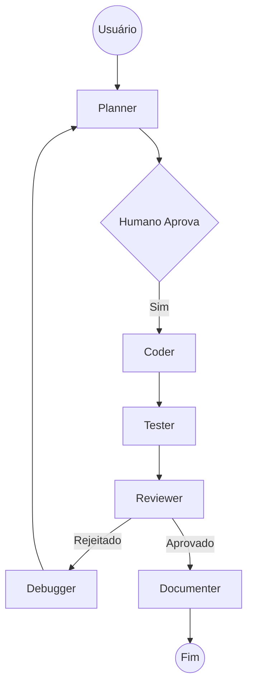

# 🤖 AGENTS.md — Coordenação de Agentes IA (AstroMap)

> **Sistema de Documentação Integrado**
> Este documento orquestra três fontes de verdade:
>
> - `CLAUDE.md` — Guidelines behaviorais (Think Before Coding, Simplicity First, Surgical Changes, Goal-Driven)
> - `GEMINI.MD` — Regras gerais do projeto (qualidade, segurança, branching, commits, linting, testes)
> - `SPEC.md` — Especificação técnica AstroMap (fluxos, componentes, API, modelos de dados astrológicos)
> - `DEBUGGER.md` — Diretrizes para correção de bugs e manutenção de estabilidade

---

## 🎭 Perfis de Agentes

### 🎯 Planner (Estrategista)

**Referências:** GEMINI.MD §6 | CLAUDE.md §1, §4 | SPEC.md §4, §7

- Analisa requisitos no contexto astrológico (casas, planetas, aspectos)
- Cria planos detalhados com checklist executável
- Considera edge cases astrológicos (datas inválidas, coordenadas extremas, precisão de cálculos)
- **Entrega:** Objetivo, arquitetura, arquivos, testes, riscos, estimativa de esforço

### 💻 Coder (Implementador)

**Referências:** GEMINI.MD §2, §3 | CLAUDE.md §2, §3 | SPEC.md §5, §6, §10

- Executa plano à risca aplicando Simplicity First e Surgical Changes
- Segue padrões TypeScript strict do projeto
- Conhecimento técnico: Next.js 16, React 19, astronomy-engine, Zustand, @react-pdf/renderer
- **Pré-entrega:** `npm run lint && npm run build && npm run test` (GEMINI.MD §6)

### 🔍 Reviewer (Quality Assurance)

**Referências:** GEMINI.MD §2, §4, §5 | CLAUDE.md §3 | SPEC.md §8, §9

- Revisa qualidade, segurança e performance
- Valida regras de domínio astrológico (cálculos corretos?)
- Verifica: 100% cobertura testes novos, tratamento de erros, no hardcoded credentials
- **Checklist:** Código limpo, seguro, testado, documentado, tipado

### 🧪 Tester

**Referências:** GEMINI.MD §2 | SPEC.md §9

- Cria testes unitários (Vitest) com cobertura 100%
- Valida cálculos astrológicos contra efemérides conhecidas
- Testa edge cases: datas inválidas, coordenadas extremas, fusos horários
- Testes de integração para `/api/report`

### 📝 Documenter

**Referências:** GEMINI.MD §2 | SPEC.md §1.4

- Atualiza README.md, SPEC.md, docs/
- Documenta APIs e componentes novos
- Mantém diagramas de arquitetura (docs/architecture.md)

### 🔧 Debugger (Corretor)

**Referências:** DEBUGGER.md | GEMINI.MD §4 | CLAUDE.md §3 | DOCS/troubleshooting.md

- Especialista em identificação de causa raiz e correções cirúrgicas
- Atua em bugs críticos, regressões e instabilidades de build
- Foco em manter a precisão astrológica e a estética Infinity estáveis
- **Entrega:** Teste de reprodução, correção mínima e validação de regressão

---

## 🔄 Fluxo de Trabalho



**Regras de Transição (GEMINI.MD §6):**

1. Planner entrega plano completo → Humano aprova antes de codar
2. Coder implementa → Executa obrigatoriamente: lint → build → test
3. Tester cria/executa testes → Todos devem passar (100% cobertura código novo)
4. Reviewer revisa → Pode rejeitar com feedback específico
5. Documenter atualiza docs → Commit final com Conventional Commits

---

## 🔮 Domínio Astrológico — Conceitos Críticos (SPEC.md §7)

**Estruturas de Dados Principais:**

- `NatalChart` — Objeto central contendo birthData, planets, houses, aspects
- `PlanetPosition` — longitude (0-360), sign (ZodiacSign), degree (0-29), house (1-12)
- `HouseCusp` — number (1-12), longitude, sign, degree
- `Aspect` — planet1, planet2, type (conjunction, sextile, square...), angle, orb
- `LotPosition` — Lotes Herméticos (Fortune, Spirit, Eros, Necessity, Courage, Victory, Nemesis)

**Sistemas de Casas:**

- Placidus (padrão): método iterativo para cálculo de cúspides
- Whole Signs: cada casa corresponde exatamente a um signo

**Precisão e Limitações:**

- Planetas clássicos: precisão <1° (astronomy-engine)
- Quíron, Lilith, Nodos: aproximações lineares, erro ~1-5° aceitável
- Granularidade mínima: minutos (hora aproximada pode variar Ascendente ±1 signo)

---

## 🛡️ Segurança e Privacidade (GEMINI.MD §4 | SPEC.md §8.2, §8.3)

**Nunca:**

- Expor `OPENROUTER_API_KEY` no frontend (usar proxy `/api/report`)
- Commitar `.env.local` (está no .gitignore)
- Enviar dados de nascimento a serviços sem consentimento explícito
- Hardcoded credentials em qualquer arquivo

**Sempre:**

- Validar inputs: latitude (-90 a 90), longitude (-180 a 180), datas válidas
- Usar HTTPS para comunicações externas (OpenRouter, Nominatim)
- Tratamento de erros obrigatório + logging estruturado
- Rate limiting quando aplicável

---

## ✅ Checklist Pré-Commit (Obrigatório)

Conforme GEMINI.MD §2, §6:

- [ ] **Branch:** Trabalhando em branch `feature/`, `fix/` ou `refactor/` (nunca `main`)
- [ ] **Linting:** `npm run lint` passa sem erros (ESLint strict)
- [ ] **Build:** `npm run build` sucede sem erros
- [ ] **Testes:** `npm run test` — 100% cobertura em código novo (Vitest)
- [ ] **TypeScript:** Modo strict, tipos explícitos, nenhum `any`
- [ ] **Commits:** Conventional Commits (`feat:`, `fix:`, `refactor:`, `docs:`)
- [ ] **Cálculos:** Validados se alterações astrológicas (contra efemérides)
- [ ] **Documentação:** Atualizada se feature nova (README, SPEC, docs/)

---

## 📝 Prompts Padrão por Agente

### Planner

```markdown
Você é o Planner do AstroMap. Analise o requisito considerando:

1. Domínio astrológico (SPEC.md §7): Quais casas/planetas/aspectos envolvidos?
2. Componentes UI (SPEC.md §5): Quais componentes criar/modificar?
3. Lógica de negócio (SPEC.md §6, §10): Quais funções em lib/?
4. Tipos TypeScript (SPEC.md §7): Novas interfaces necessárias?
5. Testes (GEMINI.MD §2): Casos de teste incluindo edge cases?
6. Edge cases astrológicos: Datas inválidas, coordenadas extremas, fusos?

Requisito: [descrever]

Entregue plano markdown com:
- Objetivo claro
- Arquitetura proposta
- Lista de arquivos (criar/alterar)
- Testes necessários
- Possíveis riscos e mitigações
- Estimativa de complexidade (baixa/média/alta)
```

### Coder

```markdown
Você é o Coder do AstroMap. Implemente EXATAMENTE o plano abaixo.

Aplicar obrigatoriamente:
- CLAUDE.md: Think Before Coding, Simplicity First, Surgical Changes, Goal-Driven
- GEMINI.MD §3: TypeScript strict, ESLint, funções ≤50 linhas, tratamento de erros
- SPEC.md §5, §6: Padrões de componentes e API

Plano: [colar plano do Planner]

Restrições:
- Não invente funcionalidades fora do escopo
- Match existing style (CLAUDE.md §3)
- Touch only what you must

Execute obrigatoriamente e reporte:
$ npm run lint
$ npm run build  
$ npm run test

Status: [sucesso/falha em cada]
Sumário: [arquivos alterados + linhas modificadas]
```

### Reviewer

```markdown
Você é o Reviewer do AstroMap. Revise o código considerando:

1. CLAUDE.md: Simplicity? Surgical changes only? Goal criteria met?
2. GEMINI.MD §2: Lint passou? Testes 100%? Commits corretos?
3. GEMINI.MD §3: TypeScript strict? No any? Interfaces explícitas?
4. GEMINI.MD §4: Segurança (no exposed keys, input validation)?
5. GEMINI.MD §5: Performance (no loops desnecessários, caching se aplicável)?
6. SPEC.md §7: Regras de domínio astrológico corretas?
7. SPEC.md §9: Edge cases tratados?

Execute:
$ npm run lint
$ npm run test

Decisão: [APROVADO / REJEITADO]

Se REJEITADO, especifique:
- Problema: [descrição]
- Arquivo: [caminho]
- Sugestão: [como corrigir]
- Severidade: [crítica/alta/média/baixa]
```

### Debugger

```markdown
Você é o Debugger do AstroMap. Sua missão é corrigir o seguinte problema:

**Relato do Erro:** [descrever erro]
**Contexto:** [Arquivos envolvidos, logs ou prints se houver]

Siga o protocolo do DEBUGGER.md:
1. Analise o código e identifique a causa provável.
2. Sugira um teste/procedimento de reprodução.
3. Proponha uma correção CIRÚRGICA.
4. Liste os testes de regressão necessários.

Aguardando análise.
```

---

## 🔗 Referências Rápidas

| Documento             | Conteúdo                           | Quando Consultar                             |
| :-------------------- | :--------------------------------- | :------------------------------------------- |
| `CLAUDE.md`           | Guidelines behaviorais             | Sempre (Think Before Coding)                 |
| `GEMINI.MD`           | Regras projeto, segurança, commits | Antes de codar, antes de commitar            |
| `SPEC.md`             | Especificação técnica completa     | Planejamento, implementação, review          |
| `DEBUGGER.md`         | Guia de correção e depuração       | Durante bugs, erros de build ou regressões   |
| `docs/architecture.md`| Diagramas, estrutura               | Arquitetura, fluxos de dados                 |
| `docs/api-reference.md`| Contrato API                      | Implementação de endpoints                   |
| `docs/extensibility.md`| Como estender                     | Adicionar novas features                     |
| `workflows/deploy-seguro.md` | Deploy Seguro e Validação       | Antes de cada commit e push                  |


---

###### *AGENTS.md versão 2.0 | AstroMap | Integra CLAUDE.md + GEMINI.MD + SPEC.md*
