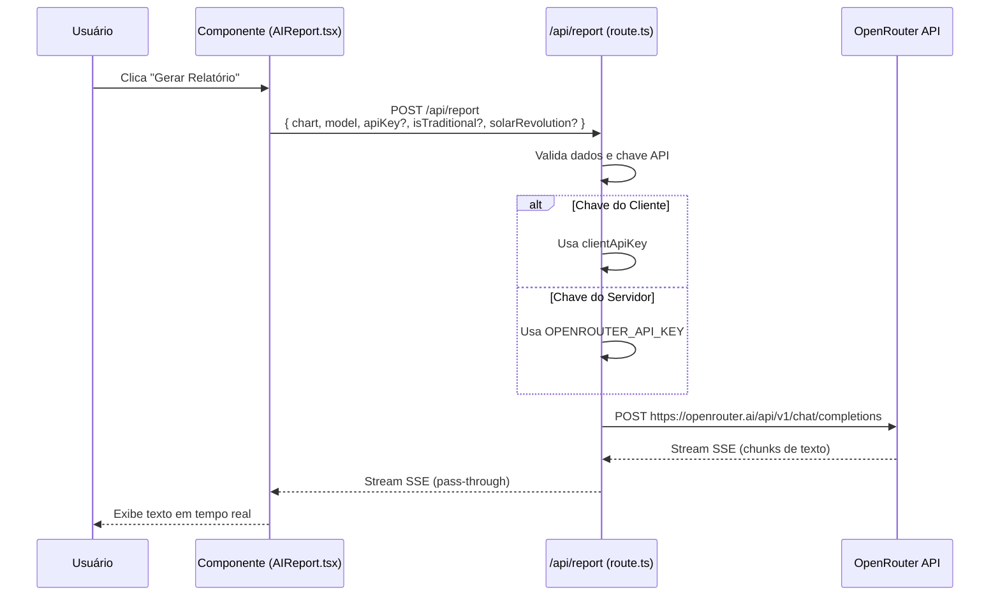
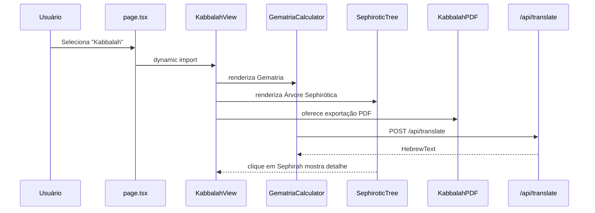

# Arquitetura — AstroMap

## Visão Geral da Arquitetura

O AstroMap é uma aplicação **Next.js (App Router)** com arquitetura **serverless-ready**. A separação clara entre cliente e servidor permite que cálculos pesados fiquem no cliente (navegador) enquanto operações que exigem segredo (chave API) ficam no servidor.

```
┌─────────────────────────────────────────────────────────────┐
│                      Navegador (Browser)                     │
│  ┌──────────┐  ┌──────────┐  ┌──────────┐  ┌──────────┐    │
│  │  Birth   │  │ Astro    │  │  AI      │  │  PDF     │    │
│  │  Form    │  │ Chart    │  │  Report  │  │  Export  │    │
│  └──────────┘  └──────────┘  └──────────┘  └──────────┘    │
│         │              │             │              │        │
│         └──────────────┴─────────────┴──────────────┘        │
│                            │                                 │
│                    ┌───────┴───────┐                        │
│                    │  Zustand      │                        │
│                    │  (Estado)     │                        │
│                    └───────────────┘                        │
└─────────────────────────────────────────────────────────────┘
                             │
                             │ HTTP POST /api/report (stream SSE)
                             ▼
┌─────────────────────────────────────────────────────────────┐
│                    Servidor Next.js                          │
│  ┌──────────────────────────────────────────────────────┐   │
│  │              src/app/api/report/route.ts              │   │
│  │  1. Recebe dados do mapa (chart)                      │   │
│  │  2. Seleciona prompt (NATAL / TRADITIONAL / SOLAR)    │   │
│  │  3. Monta mensagem com dados formatados               │   │
│  │  4. Faz fetch para OpenRouter com streaming           │   │
│  │  5. Retorna stream SSE para o cliente                 │   │
│  └──────────────────────────────────────────────────────┘   │
│                             │                                │
│                    HTTP POST (Backend-to-Backend)            │
└─────────────────────────────────────────────────────────────┘
                             │
                             ▼
┌─────────────────────────────────────────────────────────────┐
│                    OpenRouter API                            │
│  https://openrouter.ai/api/v1/chat/completions              │
│                                                             │
│  Modelos: Qwen, DeepSeek, Gemini, etc.                     │
└─────────────────────────────────────────────────────────────┘
```

---

## Diagrama de Fluxo de Dados

```mermaid
flowchart TD
    A["📝 BirthForm<br/>Usuário insere dados<br/>de nascimento"] --> B["🧮 calculateNatalChart<br/>Cálculo astronômico<br/>no cliente"]
    B --> C["🗺️ AstroChart<br/>Renderização SVG<br/>da roda zodiacal"]
    B --> D["📊 Tabelas<br/>Planetas, Casas,<br/>Aspectos, Lotes"]
    C --> E["🤖 AIReport<br/>Requisição POST<br/>/api/report"]
    D --> E
    E --> F{"Usuário tem<br/>API Key?"}
    F -->|Sim (cliente)| G["📤 Envia chave<br/>no corpo da requisição"]
    F -->|Não (servidor)| H["🔑 Usa OPENROUTER_API_KEY<br/>do .env.local"]
    G --> I["🌐 OpenRouter API<br/>Streaming SSE"]
    H --> I
    I --> J["📡 Recebe chunks SSE<br/>e exibe em tempo real"]
    J --> K["💾 SavedCharts<br/>Salva no localStorage"]
    K --> L["📄 ExportPDF<br/>Gera PDF com<br/>@react-pdf/renderer"]
```

---

## Estrutura de Diretórios

```
src/
├── app/                          # App Router (Next.js 13+)
│   ├── page.tsx                  # Página principal
│   ├── layout.tsx                # Layout raiz
│   ├── globals.css               # Estilos globais
│   └── api/
│       └── report/
│           └── route.ts          # Endpoint POST /api/report
│
├── components/                   # Componentes React
│   ├── BirthForm.tsx             # Formulário de dados de nascimento
│   ├── AstroChart.tsx            # Roda zodiacal SVG interativa
│   ├── AIReport.tsx              # Componente de geração de relatório IA
│   ├── AdvancedAnalysis.tsx      # Análise avanzada (dignidades, disposição)
│   ├── SolarRevolution.tsx       # Cálculo de Revolução Solar
│   ├── ExportPDF.tsx             # Exportação de PDF
│   ├── SavedCharts.tsx           # Listagem de mapas salvos
│   ├── PlanetTable.tsx           # Tabela de posições planetárias
│   ├── HousesTable.tsx           # Tabela de cúspides
│   ├── AspectsList.tsx           # Lista de aspectos
│   ├── AspectGrid.tsx            # Grid visual de aspectos
│   ├── LotTable.tsx              # Tabela de Lotes Herméticos
│   ├── ChartCanvas.tsx           # Canvas para renderização
│   ├── ChartPDF.tsx              # Componente PDF do mapa
│   ├── ChartSimplePDF.tsx        # PDF simplificado
│   ├── UnifiedMenu.tsx           # Menu unificado de navegação
│   │
│   └── traditional/              # Módulo de Astrologia Tradicional
│       ├── TraditionalView.tsx       # Visão geral tradicional
│       ├── TraditionalChart.tsx      # Carta tradicional SVG
│       ├── TraditionalAIReport.tsx   # Relatório IA tradicional
│       ├── TraditionalSummary.tsx    # Sumário técnico
│       ├── TraditionalPositionsTable.tsx
│       ├── TraditionalPlanetTable.tsx
│       ├── TraditionalPlanetDrawer.tsx
│       ├── TraditionalAspectList.tsx
│       └── TraditionalSpecialPoints.tsx
│
├── lib/                          # Lógica de negócio
│   ├── ephemeris.ts              # Cálculos de efemérides (astronomy-engine)
│   ├── astrology.ts              # Funções astrológicas utilitárias
│   ├── geocoding.ts              # Geocoding via Nominatim
│   ├── openrouter.ts             # Cliente OpenRouter (legacy)
│   ├── aiPrompts.ts              # Prompts do sistema para IA
│   ├── settingsStore.ts          # Zustand store para configurações
│   ├── storage.ts                # Persistência localStorage
│   ├── chartToImage.ts           # Conversão de carta para imagem
│   ├── chartHydration.ts         # Hidratação de dados da carta
│   ├── planetNaming.ts           # Nomenclatura de planetas
│   │
│   └── traditional/              # Lógica de Astrologia Tradicional
│       ├── types.ts              # Tipos e interfaces tradicionais
│       ├── dignities.ts          # Dignidades essenciais
│       ├── points.ts             # Cálculo de pontos vitais
│       ├── scoring.ts            # Sistema de pontuação Almuten
│       ├── rulers.ts             # Regências e hierarquia
│       ├── lots.ts               # Cálculo dos Lotes Herméticos
│       ├── sect.ts               # Seção diurna/noturna
│       ├── aspects.ts            # Aspectos tradicionais
│       └── interpretations.ts    # Interpretações de dignidade
│
├── hooks/                        # Custom Hooks
│   └── useGeocoding.ts           # Hook para busca de localização
│
├── types/                        # Definições TypeScript
│   └── index.ts                  # Interfaces principais
│
└── __tests__/                    # Testes unitários (Vitest)
    ├── ephemeris.test.ts
    ├── astrology.test.ts
    ├── geocoding.test.ts
    └── aiPrompts.test.ts
```

---

## Módulos Principais

### `ephemeris.ts` — Cálculo do Mapa Astral

Este é o módulo de **núcleo astronomical**. Responsável por:

1. **Inicialização do astronomy-engine** — valida que o módulo está disponível
2. **`dateToJD`** — conversão de data para Dia Juliano
3. **`calculateNatalChart`** — função principal que:
   - Calcula posições planetárias via `astronomy-engine`
   - Calcula cúspides pelo método Placidus iterativo
   - Calcula cúspides Whole Signs
   - Determina a seita (diurno/noturno)
   - Calcula os 7 Lotes Herméticos
   - Calcula os Pontos Tradicionais (Almuten, Hyleg, Alcocoden)
   - Calcula aspectos entre planetas
4. **`calculateSolarReturn`** — encontra o momento exato do retorno solar via busca binária

### `astrology.ts` — Funções Astrológicas Utilitárias

- `getZodiacSign(longitude)` — retorna o signo para uma longitude eclíptica
- `getSignDegree(longitude)` — retorna o grau dentro do signo (0-29°)
- `getHouseForPlanet(longitude, houses)` — determina a casa de um planeta
- `getDignity(planet, sign)` — retorna o nível de dignidade essencial
- `getDomicileRuler(sign)` — retorna oregente de um signo
- `calculateDispositorChain(planets)` — gera a cadeia de disposição
- `getInterceptedSigns(houses)` — identifica signos interceptados
- `calculateAspectType(angle)` — determina o tipo de aspecto
- `calculateCrossAspects(planetsA, planetsB)` — aspectos cruzados (natal ↔ solar)

### `aiPrompts.ts` — Prompts do Sistema

Contém três prompts de sistema distintos:

1. **`NATAL_PROMPT_SYSTEM`** — análise psicológica/ arquetípica moderna
2. **`TRADITIONAL_PROMPT_SYSTEM`** — análise técnica helenística/medieval
3. **`SOLAR_RETURN_PROMPT_SYSTEM`** — análise preditiva de revolucion solar

E três funções de formatação:

- `formatChartForAI(chart)` — dados natais com dignidades e cadeia de disposição
- `formatSolarComparisonForAI(natal, solar, year)` — comparação natal ↔ RS com aspectos cruzados
- `formatTraditionalChartForAI(chart, assessments)` — dados técnicos tradicionais com pontuação

### `settingsStore.ts` — Configurações do Usuário

Store Zustand com `persist` que armazena:

- **Orbs de aspectos** — margem de tolerância para cada tipo de aspecto (configurável pelo usuário)

---

## Fluxo de Requisição de Relatório IA



---

## Modelo de Dados — NatalChart

```typescript
interface NatalChart {
  birthData: BirthData;          // Dados de nascimento
  planets: PlanetPosition[];     // 12+ planetas com posições
  housesPlacidus: HouseCusp[];   // 12 cúspides (Placidus)
  housesWhole: HouseCusp[];      // 12 cúspides (Whole Signs)
  aspects: Aspect[];             // Aspectos entre planetas
  ascendant: number;             // Longitude do Ascendente
  mc: number;                    // Longitude do Meio do Céu
  lots?: LotPosition[];          // 7 Lotes Herméticos
  traditionalPoints?: TraditionalPoints; // Almuten, Hyleg, etc.
  isDayChart?: boolean;          // Se é mapa diurno
}
```

---

## Estratégia de Cache e Performance

- **`localStorage`** — mapas salvos pelo usuário para rápido acesso
- **Streaming SSE** — relatórios são exibidos progressivamente, sem waiting
- **Cálculos no cliente** — posições planetárias são calculadas no navegador, reduzindo carga no servidor
- **Astronomy Engine carregado uma vez** — inicialização no primeiro cálculo, reaproveitado em cálculos subsequentes

---

## Segurança

- A chave API **nunca é exposta** no frontend quando configurada no servidor
- O servidor proxy de API impede que credenciais cheguem ao navegador
- `.env.local` está no `.gitignore`, garantindo que nunca seja commitado
- Opção de usar chave do cliente (armazenada apenas em memória) para usuarios que preferem não expor no servidor
## Kabbalah Hermética

### Fluxo de Cliente

O módulo Kabbalah é carregado apenas quando o usuário seleciona a tab `kabbalah` no menu principal.



### Responsabilidades

- `GematriaCalculator` traduz e calcula quatro sistemas de gematria.
- `SephiroticTree` mapeia os planetas do `NatalChart` nas Sephiroth e mostra detalhes ao clique.
- `KabbalahPDF` gera um PDF enxuto com o resumo da leitura.
- `app/api/translate/route.ts` mantém a conversão em server-side e protege a chave do frontend.

### Contratos de Isolamento

- `lib/kabbalah/*` depende apenas de tipos compartilhados e utilitários de domínio.
- `components/kabbalah/*` pode consumir `lib/kabbalah/*`, mas não altera o core astrológico.
- O fluxo Kabbalah não entra em `lib/traditional/*` nem em `lib/ephemeris.ts`.

### Estado da UI

- A tab `gematria` mostra o calculador e o resultado.
- A tab `tree` mostra a projeção sephirótica e o detalhe selecionado.
- O PDF fica disponível como uma ação secundária do cabeçalho Kabbalah.
