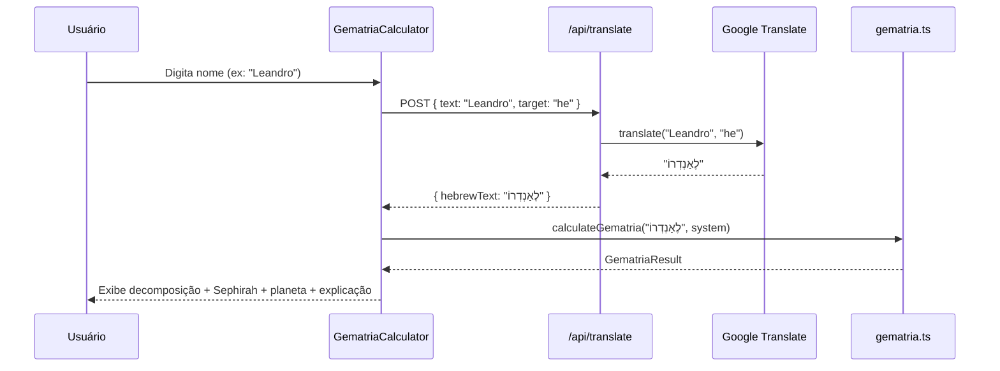
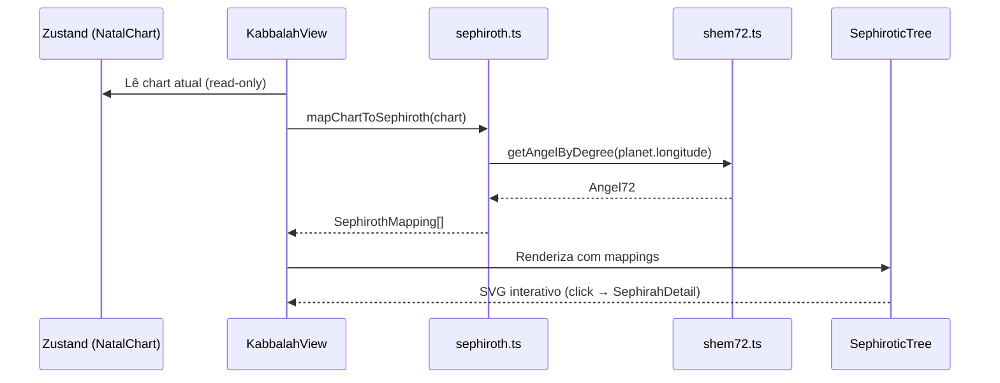

# 🔯 SPEC — Módulos de Kabbalah (Gematria + Árvore Sephirótica)

> **Modo:** SPEC MODE
> **Base:** [Project Canvas v3](file:///C:/Users/leand/.gemini/antigravity/brain/d96877fa-4032-4142-9a17-003cabe8dc0d/project-canvas-kabbalah.md)
> **Data:** 2026-04-29

---

## 1. Objetivo

Implementar dois módulos isolados de **Kabbalah Hermética (Golden Dawn)** no AstroMap:

- **Módulo A — Gematria do Nome**: calculadora que converte automaticamente o nome do usuário para hebraico (via Google Translate API) e calcula o valor gemátrico em 4 sistemas.
- **Módulo B — Árvore Sephirótica**: SVG interativo que projeta os planetas do mapa natal carregado sobre as 10 Sephiroth + Da'at, com lookup dos 72 Anjos por grau eclíptico.

---

## 2. Escopo

### Incluído

- Gematria (4 sistemas: hebraica standard, ordinal, mispar katan, latina simples)
- Conversão automática nome → hebraico via API (rota `/api/translate`)
- Árvore SVG interativa com tema Infinity (dark + gold + glass)
- 72 Anjos com nomes hebraicos, salmos e lookup por grau
- Cruzamento `NatalChart` → Sephiroth → Anjos
- Exportação PDF dos dados Kabbalah
- Testes 100% cobertura em código novo
- Textos bilíngues (PT + hebraico) com transliteração

### Fora de Escopo

- Relatórios gerados por IA
- Sinastria cabalística
- Tarot nos caminhos (arquitetura extensível, mas fora de implementação)
- Meditação guiada
- Cálculos para outros mapas que não o carregado atualmente

---

## 3. Fora de Escopo (Não-Objetivos)

- Alterar o core astrológico (`src/lib/ephemeris.ts`, `src/lib/traditional/`)
- Criar novas rotas de API além de `/api/translate`
- Adicionar fontes hebraicas no CSS (renderizar via imagem/ícone)
- Implementar funcionalidade de Tarot nos paths do SVG

---

## 4. Fluxos Esperados

### 4.1 Fluxo da Gematria



### 4.2 Fluxo da Árvore Sephirótica



---

## 5. Requisitos Principais

### 5.1 Requisitos Funcionais

| ID | Requisito | Prioridade |
|----|-----------|------------|
| RF01 | Conversão automática nome→hebraico via Google Translate | Alta |
| RF02 | Cálculo de gematria em 4 sistemas (standard, ordinal, mispar katan, latina) | Alta |
| RF03 | Redução do valor gemátrico a uma Sephirah (1-10) | Alta |
| RF04 | Exibição de decomposição letra→valor | Alta |
| RF05 | SVG da Árvore com 10 Sephiroth + Da'at + 22 caminhos | Alta |
| RF06 | Projeção dos planetas do NatalChart nas Sephiroth correspondentes | Alta |
| RF07 | Lookup do anjo regente por grau eclíptico de cada planeta | Alta |
| RF08 | Drawer de detalhes ao clicar em Sephirah (planeta, grau, anjo, salmo) | Alta |
| RF09 | Seção própria no UnifiedMenu (tab `kabbalah`) | Alta |
| RF10 | Exportação PDF dos dados Kabbalah | Média |
| RF11 | Responsividade mobile (SVG via viewBox) | Alta |
| RF12 | Textos bilíngues PT + hebraico com transliteração | Média |

### 5.2 Requisitos Não-Funcionais

| ID | Requisito |
|----|-----------|
| RNF01 | 100% cobertura de testes em código novo (Vitest) |
| RNF02 | TypeScript strict, sem `any` |
| RNF03 | Isolamento de domínio: nunca importar de `lib/kabbalah/` dentro de `lib/traditional/` ou `lib/ephemeris.ts` |
| RNF04 | Tema Infinity: dark bg `#020617`, gold `#d4af37`, glass effects |
| RNF05 | Acessibilidade: `aria-label` em nós SVG interativos |
| RNF06 | Performance: lazy loading do módulo Kabbalah via `dynamic()` |

---

## 6. Regras e Restrições

### 6.1 Isolamento de Domínio (D02)

```
✅ lib/kabbalah/ PODE importar de → types/index.ts (NatalChart, PlanetPosition, ZodiacSign)
✅ components/kabbalah/ PODE importar de → lib/kabbalah/*, types/index.ts
❌ lib/traditional/ NÃO PODE importar de → lib/kabbalah/
❌ lib/ephemeris.ts NÃO PODE importar de → lib/kabbalah/
❌ lib/kabbalah/ NÃO PODE modificar → NatalChart ou core types
```

### 6.2 Correspondência Sephirah-Planeta (Golden Dawn / Hermética)

| Sephirah | Nº | Planeta do NatalChart | planet.id no core |
|----------|----|-----------------------|-------------------|
| Kether | 1 | Netuno | `neptune` |
| Chokmah | 2 | Urano | `uranus` |
| Binah | 3 | Saturno | `saturn` |
| Da'at | — | Plutão | `pluto` |
| Chesed | 4 | Júpiter | `jupiter` |
| Geburah | 5 | Marte | `mars` |
| Tiphereth | 6 | Sol | `sun` |
| Netzach | 7 | Vênus | `venus` |
| Hod | 8 | Mercúrio | `mercury` |
| Yesod | 9 | Lua | `moon` |
| Malkuth | 10 | Ascendente* | `chart.ascendant` |

*\*Malkuth usa `chart.ascendant` (longitude 0-360), não é um `PlanetPosition`.*

### 6.3 Fórmula de Lookup dos 72 Anjos

```typescript
function getAngelIndex(longitude: number): number {
  // longitude: 0-360 graus eclípticos
  // Cada anjo rege 5 graus, começando em 0° Áries
  return Math.floor(longitude / 5); // resultado: 0-71
}
```

### 6.4 Tabela de Gematria Hebraica (Standard / Mispar Gadol)

```typescript
const HEBREW_VALUES: Record<string, number> = {
  'א': 1,  'ב': 2,  'ג': 3,  'ד': 4,  'ה': 5,
  'ו': 6,  'ז': 7,  'ח': 8,  'ט': 9,  'י': 10,
  'כ': 20, 'ך': 20, 'ל': 30, 'מ': 40, 'ם': 40,
  'נ': 50, 'ן': 50, 'ס': 60, 'ע': 70, 'פ': 80,
  'ף': 80, 'צ': 90, 'ץ': 90, 'ק': 100,'ר': 200,
  'ש': 300,'ת': 400,
};
```

### 6.5 Redução Gemátrica → Sephirah

```typescript
function reduceToSephirah(value: number): number {
  // Redução teosófica: somar dígitos até obter 1-10
  let n = value;
  while (n > 10) {
    n = n.toString().split('').reduce((s, d) => s + parseInt(d), 0);
  }
  return n; // 1 = Kether ... 10 = Malkuth
}
```

---

## 7. Dados e Contratos TypeScript

### 7.1 Tipos Kabbalah (`src/lib/kabbalah/types.ts`)

```typescript
import type { ZodiacSign } from '@/types';

// ─── Sephiroth ───

export type SephirahName =
  | 'Kether' | 'Chokmah' | 'Binah' | 'Daath'
  | 'Chesed' | 'Geburah' | 'Tiphereth'
  | 'Netzach' | 'Hod' | 'Yesod' | 'Malkuth';

export type PillarName = 'Misericórdia' | 'Severidade' | 'Equilíbrio';

export interface SephirahDefinition {
  readonly name: SephirahName;
  readonly number: number;               // 1-10 (0 para Da'at)
  readonly hebrew: string;               // ex: "כתר"
  readonly transliteration: string;       // ex: "Kéter"
  readonly meaning: string;              // ex: "Coroa"
  readonly planetId: string;             // ex: "neptune" | "ascendant"
  readonly pillar: PillarName;
  readonly color: string;                // hex para SVG
  readonly description: {
    pt: string;
    he: string;
  };
}

// ─── 72 Anjos ───

export interface Angel72 {
  readonly number: number;               // 1-72
  readonly name: string;                 // ex: "Vehuiah"
  readonly hebrew: string;               // ex: "והויה"
  readonly sign: ZodiacSign;
  readonly degreesStart: number;         // 0-355 (eclíptico absoluto)
  readonly degreesEnd: number;           // 4.999...-359.999
  readonly virtues: string;
  readonly psalm: string;                // ex: "Sl 3:4"
}

// ─── Gematria ───

export type GematriaSystem = 'standard' | 'ordinal' | 'misparKatan' | 'latin';

export interface LetterBreakdown {
  readonly letter: string;
  readonly value: number;
}

export interface GematriaResult {
  readonly inputText: string;            // texto original do usuário
  readonly hebrewText: string;           // texto convertido para hebraico
  readonly system: GematriaSystem;
  readonly totalValue: number;
  readonly reducedValue: number;          // 1-10
  readonly sephirah: SephirahName;
  readonly breakdown: readonly LetterBreakdown[];
}

// ─── Cruzamento Chart → Sephiroth ───

export interface SephirothPlanetMapping {
  readonly sephirah: SephirahDefinition;
  readonly planetName: string;           // nome em PT do planeta
  readonly planetSymbol: string;
  readonly longitude: number;            // 0-360
  readonly sign: ZodiacSign;
  readonly degree: number;               // 0-29 no signo
  readonly house: number;                // 1-12
  readonly retrograde: boolean;
  readonly angel: Angel72;               // anjo regente por grau
}

// Tipo especial para Malkuth (Ascendente, não é PlanetPosition)
export interface MalkuthMapping {
  readonly sephirah: SephirahDefinition;
  readonly longitude: number;
  readonly sign: ZodiacSign;
  readonly degree: number;
  readonly house: 1;                     // Ascendente = sempre casa 1
  readonly angel: Angel72;
}

export type SephirothMapping = SephirothPlanetMapping | MalkuthMapping;

// ─── Translate API ───

export interface TranslateRequest {
  readonly text: string;
  readonly targetLang: string;           // "he"
}

export interface TranslateResponse {
  readonly translatedText: string;
  readonly detectedSourceLang?: string;
}
```

### 7.2 Geometria SVG da Árvore (`src/lib/kabbalah/constants.ts`)

Coordenadas normalizadas para `viewBox="0 0 400 600"`:

```typescript
export const SEPHIROTH_COORDS: Record<SephirahName, { x: number; y: number }> = {
  Kether:     { x: 200, y: 40  },
  Chokmah:    { x: 310, y: 100 },
  Binah:      { x: 90,  y: 100 },
  Daath:      { x: 200, y: 160 },
  Chesed:     { x: 310, y: 220 },
  Geburah:    { x: 90,  y: 220 },
  Tiphereth:  { x: 200, y: 290 },
  Netzach:    { x: 310, y: 370 },
  Hod:        { x: 90,  y: 370 },
  Yesod:      { x: 200, y: 440 },
  Malkuth:    { x: 200, y: 540 },
};

// Raio dos nós em SVG units
export const SEPHIRAH_RADIUS = 28;

// 22 Caminhos (Paths) — pares de Sephiroth conectadas
export const TREE_PATHS: readonly [SephirahName, SephirahName][] = [
  ['Kether', 'Chokmah'],    // 1
  ['Kether', 'Binah'],      // 2
  ['Kether', 'Tiphereth'],  // 3
  ['Chokmah', 'Binah'],     // 4
  ['Chokmah', 'Chesed'],    // 5
  ['Chokmah', 'Tiphereth'], // 6
  ['Binah', 'Geburah'],     // 7
  ['Binah', 'Tiphereth'],   // 8
  ['Chesed', 'Geburah'],    // 9
  ['Chesed', 'Tiphereth'],  // 10
  ['Chesed', 'Netzach'],    // 11
  ['Geburah', 'Tiphereth'], // 12
  ['Geburah', 'Hod'],       // 13
  ['Tiphereth', 'Netzach'], // 14
  ['Tiphereth', 'Yesod'],   // 15
  ['Tiphereth', 'Hod'],     // 16
  ['Netzach', 'Hod'],       // 17
  ['Netzach', 'Yesod'],     // 18
  ['Netzach', 'Malkuth'],   // 19
  ['Hod', 'Yesod'],         // 20
  ['Hod', 'Malkuth'],       // 21
  ['Yesod', 'Malkuth'],     // 22
];

// Cores dos Pilares
export const PILLAR_COLORS = {
  'Misericórdia': '#3b82f6',  // blue
  'Severidade':   '#ef4444',  // red
  'Equilíbrio':   '#d4af37',  // gold
} as const;
```

---

## 8. Estrutura de Arquivos Final

```
src/
├── lib/kabbalah/
│   ├── types.ts              # Interfaces (§7.1)
│   ├── gematria.ts           # 4 sistemas + redução + Malkuth (§6.4, §6.5)
│   ├── sephiroth.ts          # Definições + mapChartToSephiroth()
│   ├── shem72.ts             # 72 anjos (dados completos + getAngelByDegree)
│   └── constants.ts          # Coords SVG, paths, cores, HEBREW_VALUES (§7.2)
│
├── components/kabbalah/
│   ├── GematriaCalculator.tsx # Input nome + botão converter + resultado
│   ├── GematriaResult.tsx     # Decomposição visual + Sephirah dominante
│   ├── SephiroticTree.tsx     # SVG interativo (viewBox 400x600)
│   ├── SephirahDetail.tsx     # Drawer/modal de detalhes
│   ├── KabbalahView.tsx       # Container: tabs internas (Gematria | Árvore)
│   └── KabbalahPDF.tsx        # Exportação PDF (@react-pdf/renderer)
│
├── app/api/translate/
│   └── route.ts              # Proxy Google Translate (server-side)
│
└── __tests__/kabbalah/
    ├── gematria.test.ts       # Valores conhecidos, edge cases, redução
    ├── shem72.test.ts         # Lookup por grau, boundary cases
    ├── sephiroth.test.ts      # Mapping chart→sephiroth
    └── translate.test.ts      # API route mock
```

---

## 9. Integração com Codebase Existente

### 9.1 `page.tsx` — Nova Tab

```typescript
// Adicionar ao type de activeTab:
type ActiveTab = 'chart' | 'traditional' | 'houses' | 'aspects'
              | 'report' | 'revolution' | 'elective' | 'kabbalah';

// Adicionar ao allMenuItems:
{ id: 'kabbalah', label: 'Kabbalah', icon: Hexagon }  // lucide-react

// Adicionar dynamic import:
const KabbalahView = dynamic(
  () => import('@/components/kabbalah/KabbalahView'),
  { loading: () => <TabLoading /> }
);

// Adicionar renderização condicional:
{activeTab === 'kabbalah' && <KabbalahView chart={chart} />}
```

### 9.2 `/api/translate/route.ts` — Proxy Seguro

```typescript
// POST /api/translate
// Body: { text: string, targetLang: "he" }
// Response: { translatedText: string }
//
// Usa Google Translate gratuito (sem API key).
// Server-side only para evitar CORS.
// Rate limiting: 10 req/min por IP.
// Validação: text max 100 chars, targetLang must be "he".
```

> [!IMPORTANT]
> **API Route retorna JSON em todos os cenários de erro** (regra A01 do MAESTRO).

### 9.3 PDF — Extensão do `ExportPDF.tsx`

Abordagem: criar `KabbalahPDF.tsx` como componente autônomo com seu próprio `PDFDownloadLink`, seguindo o padrão de `ExportPDF.tsx` (estilos DejaVu Sans, layout gold/indigo).

---

## 10. Critérios de Validação por Sprint

### Sprint 1 — Fundação

| Critério | Como Validar |
|----------|-------------|
| `types.ts` compila sem erros | `npm run build` |
| `HEBREW_VALUES` cobre todas 27 letras (22 + 5 finais) | Teste unitário |
| `getAngelByDegree(0)` retorna Vehuiah | Teste unitário |
| `getAngelByDegree(359)` retorna Mumiah | Teste unitário |
| `getAngelByDegree(5)` retorna Jeliel | Teste unitário boundary |
| `calculateGematria("שלום", 'standard')` === 376 | Teste unitário |
| `reduceToSephirah(376)` === 7 (Netzach) | Teste unitário |
| Gematria latina "LEANDRO" funciona | Teste unitário |
| 100% cobertura em `lib/kabbalah/` | `npm run test -- --coverage` |

### Sprint 2 — Gematria UI

| Critério | Como Validar |
|----------|-------------|
| Input aceita qualquer idioma | Teste manual no browser |
| POST `/api/translate` retorna hebraico | Teste de integração |
| Resultado mostra decomposição letra-a-letra | Screenshot/visual |
| Sephirah dominante exibida com cor correta | Visual |
| Tab "Kabbalah" aparece no menu | Visual |
| Erro de API mostra mensagem amigável | Teste de componente |

### Sprint 3 — Árvore Sephirótica

| Critério | Como Validar |
|----------|-------------|
| SVG renderiza 10+1 nós + 22 paths | DOM inspection |
| Planetas projetados nas Sephiroth corretas | Teste: Sol → Tiphereth |
| Click em nó abre drawer com detalhes | Teste de interação |
| Drawer mostra anjo + salmo correto | Teste: Sol em 15° Áries → Elemiah, Sl 6:5 |
| Ascendente aparece em Malkuth | Teste unitário |
| Mobile: SVG responsivo via viewBox | Resize browser |
| `aria-label` em todos os nós interativos | Lighthouse |

### Sprint 4 — PDF e Polish

| Critério | Como Validar |
|----------|-------------|
| PDF gera sem erro | Download e abertura |
| PDF contém tabela de correspondências | Visual |
| Micro-animações nos nós SVG (hover) | Visual |
| `npm run lint` sem erros | CI |
| `npm run build` sem erros | CI |
| `npm run test` 100% cobertura novo código | CI |

---

## 11. Dependências

| Dependência | Status | Nota |
|-------------|--------|------|
| `@react-pdf/renderer` | ✅ Já instalado | Para KabbalahPDF |
| `lucide-react` | ✅ Já instalado | Ícone Hexagon para tab |
| Google Translate (free tier) | Externo | Sem API key necessária |
| Zustand (NatalChart store) | ✅ Já usado | Read-only no Kabbalah |
| `astronomy-engine` | ✅ Já instalado | Não será usado diretamente |

---

## 12. Riscos

| Risco | Probabilidade | Impacto | Mitigação |
|-------|--------------|---------|-----------|
| Google Translate rate limiting | Média | Médio | Cache local + debounce 500ms no input |
| SVG complexo em mobile | Média | Alto | Prototipar viewBox 400x600 primeiro, testar em viewport 320px |
| Hebraico renderizado incorretamente | Baixa | Médio | Usar texto SVG nativo (suporte Unicode), fallback para transliteração |
| Tradução imprecisa de nomes próprios | Alta | Baixo | Exibir transliteração lado a lado, permitir edição manual do hebraico |

---

## 13. Questões em Aberto

> [!TIP]
> ### Q1: Estratégia de conversão hebraica — ✅ DECIDIDO
> O input de hebraico segue uma **cadeia de 3 fontes**, por prioridade:
>
> 1. **Input manual** — O usuário pode digitar diretamente em hebraico no campo editável.
> 2. **Google Translate** — Se o usuário digitar em outro idioma, o app converte automaticamente via `/api/translate`.
> 3. **Fallback LLM** — Se o Google Translate falhar, usar a LLM já integrada no app (OpenRouter via `/api/report`) para traduzir o nome para hebraico.
>
> O campo hebraico é sempre **editável** — o usuário pode corrigir a tradução antes de calcular.

> [!TIP]
> ### Q2: Campo hebraico editável — ✅ DECIDIDO
> Sim. O hebraico traduzido aparece em um campo editável. O cálculo de gematria usa **o que estiver no campo** no momento do cálculo, independentemente de ter sido digitado manualmente ou gerado pela tradução.

---

## 14. Próxima Rota

> **→ BUILD FLOW** (Sprint 1: Fundação)
>
> Criar branch `feature/kabbalah-modules` e executar Sprint 1.
## 15. Status de Entrega

> **Status atual:** Kabbalah implementada no workspace com Gematria, Árvore Sephirótica, rota de tradução e exportação PDF.

### 15.1 Arquivos entregues

- `src/lib/kabbalah/types.ts`
- `src/lib/kabbalah/constants.ts`
- `src/lib/kabbalah/gematria.ts`
- `src/lib/kabbalah/sephiroth.ts`
- `src/lib/kabbalah/shem72.ts`
- `src/lib/kabbalah/translate.ts`
- `src/lib/kabbalah/translateClient.ts`
- `src/components/kabbalah/GematriaCalculator.tsx`
- `src/components/kabbalah/GematriaResult.tsx`
- `src/components/kabbalah/SephiroticTree.tsx`
- `src/components/kabbalah/KabbalahPDF.tsx`
- `src/components/kabbalah/KabbalahView.tsx`
- `src/app/api/translate/route.ts`

### 15.2 Integrações concluídas

- Tab `kabbalah` no menu principal
- Lazy loading do painel Kabbalah na home
- Conversão server-side em `/api/translate`
- SVG interativo com 22 caminhos e 11 nós
- Painel de detalhes por Sephirah
- Botão de exportação PDF com fallback seguro para SSR/teste

### 15.3 Validação atual

- `npm run lint` passa com warnings legados do projeto
- `npm run build` passa
- `npm run test` passa

### 15.4 Observações

- O isolamento de domínio foi mantido.
- O PDF foi blindado para não quebrar em ambiente Node/testes.
- O próximo passo natural é polimento visual e eventual ampliação de materiais de apoio.
