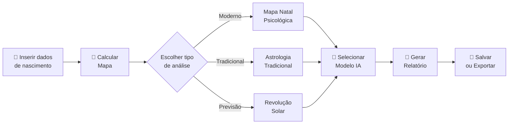

# Uso — AstroMap

## Primeiro Passo: Criar um Mapa Astral

### 1. Preencha o Formulário de Nascimento

No formulário inicial, insira:

- **Nome** — identificação do mapa
- **Data de nascimento** — no formato `YYYY-MM-DD`
- **Hora de nascimento** — no formato `HH:MM` (precisão de minutos)
- **Local de nascimento** — cidade/estado (o sistema busca automaticamente via Nominatim, filtrado para o Brasil)

> **Nota:** A hora de nascimento é crucial para a precisão do Ascendente e das cúspides das casas. Mapas sem hora aproximada têm menor precisão.

### 2. Configure o Sistema de Casas

Escolha entre:

- **Placidus** (padrão) — método iterativo moderno, mais preciso para latitudes temperadas
- **Whole Signs** (Signos Inteiros) — método tradicional onde cada casa corresponde exatamente a um signo

### 3. Clique em "Calcular Mapa"

O sistema irá:

1. Buscar coordenadas geográficas da cidade
2. Calcular o fuso horário com detecção de horário de verão brasileiro
3. Calcular posições planetárias via `astronomy-engine`
4. Calcular cúspides das casas (ambos sistemas)
5. Calcular aspectos entre planetas
6. Renderizar a roda zodiacal interativa

---

## Navegando pela Interface

### Roda Zodiacal (AstroChart)

A visualização central exibe:

- **12 signos** ao redor da roda, com cores por elemento
- **Planetas** posicionados em seus signos e casas correspondentes
- **Cúspides** das casas com numeração
- **Aspectos** desenhados como linhas entre planetas (opcional)
- **Retrogradação** indicada com símbolo `℞`

**Interações:**
- Clique em um planeta para ver detalhes na tabela
- Passe o mouse sobre um planeta para ver coordenadas exatas

### Abas de Análise

A interface contém abas com diferentes visões:

| Aba | Conteúdo |
|-----|----------|
| **Posições** | Tabela completa de planetas com signo, grau, casa e dignidade |
| **Casas** | Cúspides das 12 casas em ambos os sistemas |
| **Aspectos** | Lista de aspectos com ângulos, órbitas e indicação de aplicando/separando |
| **Lotes** | Os 7 Lotes Herméticos (Fortuna, Espírito, Eros, etc.) |
| **Avançado** | Análise de dignidades, cadeia de disposição, signos interceptados |
| **Tradicional** | Visão de astrologia clássica com Almuten, Hyleg, etc. |
| **Revolução Solar** | Cálculo de trânsitos e previsões anuais |

---

## Gerando um Relatório com IA

### 1. Selecione a Modalidade

| Modalidade | Descrição |
|------------|-----------|
| **Mapa Natal** | Análise psicológica/ arquetípica moderna |
| **Astrologia Tradicional** | Relatório técnico helenístico/medieval |
| **Revolução Solar** | Previsões para o ano (requer ano destino) |

### 2. Escolha o Modelo de IA

| Modelo | Custo | Indicado para |
|--------|-------|---------------|
| **Qwen 3 32B** | Mais econômico | Relatórios rápidos do dia a dia |
| **DeepSeek V3.1** | Econômico | Análises profundas em português |
| **Gemini 2.5 Flash** | Moderado | Análises sofisticadas e detalhadas |
| **Gemini 2.5 Flash Lite** | Baixo | Relatórios muito extensos |

### 3. Insira sua Chave API (se necessário)

Se a variável `OPENROUTER_API_KEY` não estiver configurada no servidor, você pode inserir sua própria chave na interface. Esta chave é usada apenas para esta requisição e **nunca é armazenada**.

### 4. Clique em "Gerar Relatório"

O relatório será exibido **em tempo real** à medida que a IA gera o texto (streaming SSE).

---

## Salvando e Gerenciando Mapas

### Salvar Mapa

Clique em **"Salvar Mapa"** para armazenar no `localStorage` do navegador. O mapa fica disponível para consultas futuras sem necessidade de recálculo.

### Mapas Salvos

Acesse a listagem de mapas salvos para:

- Visualizar um mapa anterior
- Gerar novo relatório
- Exportar para PDF
- Excluir mapas antigos

### Exportar PDF

Clique em **"Exportar PDF"** para gerar um documento com:

- Dados de nascimento
- Visualização da roda zodiacal
- Tabela de posições planetárias
- Relatório IA (se gerado)

---

## Usando Revolução Solar

1. Na interface principal, clique na aba **"Revolução Solar"**
2. Insira o **ano de destino** para a previsão
3. O sistema calculará automaticamente:
   - Data/hora exata do retorno solar (pode variar ±2 dias do aniversário)
   - Mapa da RS com posições do ano
   - Comparação com o mapa natal (aspectos cruzados)
   - Interposição de casas (onde cada planeta da RS cai no mapa natal)
4. Gere o relatório de RS para uma análise preditiva do ano

---

## Configurações de Aspectos

Acesse **Configurações** para ajustar:

- **Orbs dos aspectos** — tolerância em graus para cada tipo de aspecto
- Valores padrão:

| Aspecto | Orb Padrão |
|---------|------------|
| Conjunção | 8° |
| Sextil | 6° |
| Quadratura | 8° |
| Trígono | 8° |
| Oposição | 8° |

---

## Fluxo Completo de Uso

---

## Dicas de Uso

1. **Hora de nascimento** — quanto mais precisa, melhor. Mapas estimados podem ter Ascendente em signo vizinho.

2. **Sistema de casas** — se você usa astrologia tradicional/helenística, prefira **Whole Signs**. Para abordagens modernas, **Placidus** é mais comum.

3. **Modelo de IA** — para relatórios em português brasileiro, **DeepSeek V3.1** costuma oferecer excelente qualidade a custo baixo.

4. **Revolução Solar** — a data exata do retorno é calculada via busca binária. Pode variar até 2 dias do aniversário civil.

5. **Privacidade** — todos os dados ficam no seu navegador. Nenhum mapa é enviado a servidores sem sua ação explícita.