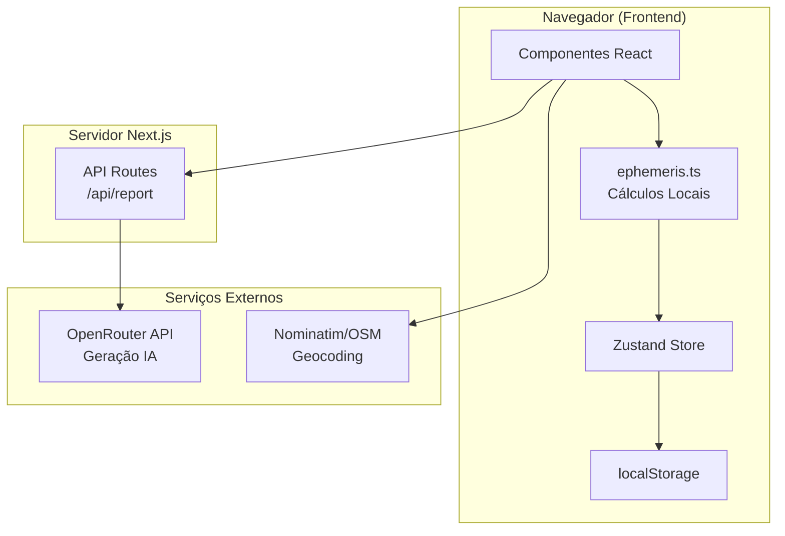
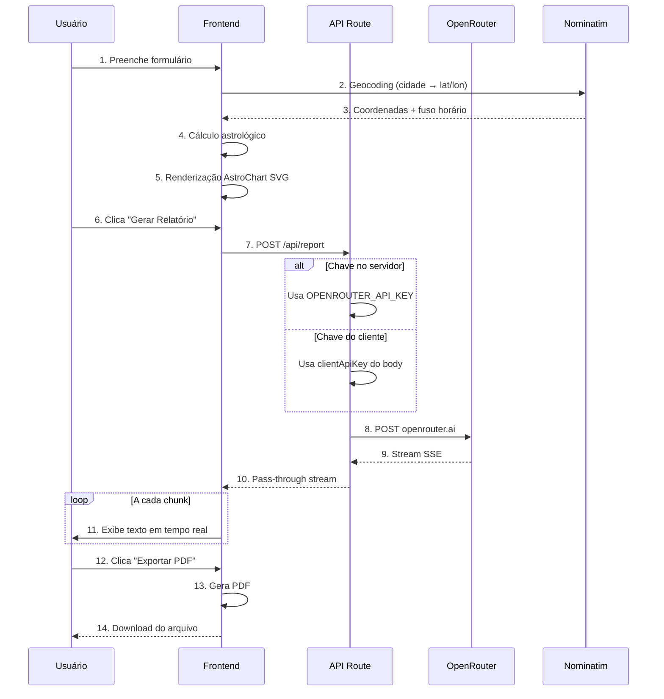

# Especificação Técnica de Desenvolvimento — AstroMap

## 1. Introdução e Escopo

### 1.1 Propósito do Documento

Este documento estabelece a especificação técnica completa para implementação, validação e manutenção do AstroMap — um aplicativo web de cálculo e interpretação de mapas astrais com geração de relatórios via inteligência artificial. A especificação orienta-se por fluxos de uso detalhados, servindo como contrato técnico entre a equipe de desenvolvimento e os critérios de aceite do produto.

### 1.2 Público-Alvo

Equipe de desenvolvimento — desenvolvedores frontend/backend, arquitetos de solução, engenheiros de QA e mantenedores do projeto. Este documento pressupõe familiaridade com TypeScript, React, Next.js e conceitos básicos de API REST com streaming.

### 1.3 Metodologia

Especificação orientada por fluxos de uso (flow-driven specification), onde cada funcionalidade é descrita através de seu comportamento passo-a-passo, pré-condições, pós-condições e fluxos alternativos. Esta abordagem permite que a implementação seja diretamente rastreável aos requisitos de comportamento do sistema.

### 1.4 Material de Referência

Este documento sintetiza e estrutura informações dos seguintes documentos existentes:

- `docs/overview.md` — funcionalidades principais e stack tecnológica
- `docs/architecture.md` — diagramas de arquitetura e estrutura de diretórios
- `docs/usage.md` — fluxos de uso e navegação da interface
- `docs/api-reference.md` — contrato detalhado da API REST
- `docs/security-privacy.md` — requisitos de segurança e privacidade
- `docs/performance-cost.md` — métricas de performance e custos operacionais
- `docs/extensibility.md` — pontos de extensão do código
- `docs/troubleshooting.md` — problemas conhecidos e soluções

---

## 2. Definições e Conceitos-Chave

### 2.1 Glossário de Termos Astrológicos

| Termo | Definição Técnica |
|-------|-------------------|
| **Ascendente** | Ponto da eclíptica que surge no horizonte leste no momento do nascimento; calculado a partir da latitude, longitude e hora local; determina a "máscara" social e primeira impressão |
| **Meio do Céu (MC)** | Ponto mais alto da eclíptica no momento do nascimento; relacionado à carreira, público e Aspiração Vital |
| **Casa** | Divisão de 12 segmentos da esfera celeste a partir do Ascendente; cada casa representa uma área da vida; calculada por sistema específico (Placidus, Whole Signs) |
| **Signo** | Cada um dos 12 setores de 30° da eclíptica, correspondentes às constelações zodiacais; determina a "expressão" de um planeta |
| **Planeta** | Corpo celeste considerado no cálculo astrológico; inclui luminares (Sol, Lua), planetas pessoais (Mercúrio, Vênus, Marte), planetas sociais (Júpiter, Saturno) e geracionais (Urano, Netuno, Plutão) |
| **Aspecto** | Ângulo geométrico entre dois planetas visto da Terra; define o tipo de interação entre suas energias |
| **Dignidade Essencial** | Nível de "força" intrínseca de um planeta em determinado signo; inclui Domicílio, Exaltação, Triplicidade, Termo, Face |
| **Retrogradação** | Movimento aparente de um planeta quando visto da Terra; indica movimento retrógrado em longitude eclíptica |
| **Lote Hermético** | Ponto calculado matematicamente a partir de posições planetárias; representa centros de significado destino (ex: Lote da Fortuna) |
| **Revolução Solar** | Momento exato em que o Sol retorna à posição natal; mapa anual que indica temas predominantes do ano |
| **Almuten Figuris** | Planeta com maior pontuação de dignidade no mapa; indica a força governante da natividade |
| **Hyleg** | Planeta que doa a vida; ponto de vitalidade fundamental na astrologia tradicional |
| **Alcocoden** | Planeta que doa os anos; relacionado à longevidade e resiliência física |

### 2.2 Atores do Sistema

| Ator | Descrição | Responsabilidades |
|------|-----------|-------------------|
| **End User** | Pessoa que acessa o aplicativo via navegador | Inserir dados de nascimento, interagir com visualizações, gerar relatórios IA, salvar/exportar mapas |
| **System (Frontend)** | Aplicação Next.js executando no navegador | Cálculos astrológicos via astronomy-engine, renderização de componentes, gerenciamento de estado Zustand, persistência localStorage |
| **System (Backend)** | API Route Next.js executando no servidor | Proxy para OpenRouter, validação de requisições, proteção de credenciais |
| **External API (OpenRouter)** | Provedor de modelos de IA via API REST | Geração de texto de relatório com streaming SSE |
| **Geocoding Service (Nominatim/OSM)** | Serviço de busca de localização | Transformar texto de cidade em coordenadas geográficas |

### 2.3 Convenções de Notação

- **Fluxos de uso**: Numeração sequencial de passos (1, 2, 3...)
- **Estados de componente**: `idle` | `loading` | `success` | `error` | `streaming`
- **Tipos TypeScript**: Referenciados como `TypeName` (ex: `NatalChart`, `PlanetPosition`)
- **Variáveis de ambiente**: `UPPER_SNAKE_CASE` (ex: `OPENROUTER_API_KEY`)
- **Endpoints**: `METHOD /caminho` (ex: `POST /api/report`)
- **Diagramas**: Mermaid para fluxos e sequências

---

## 3. Visão Geral do Sistema

### 3.1 Arquitetura de Alto Nível

O AstroMap segue uma arquitetura cliente-servidor com computação distribuída: cálculos astrológicos pesados são executados no navegador (cliente), enquanto a comunicação com provedores de IA é mediada pelo servidor Next.js para proteção de credenciais.



### 3.2 Fluxo de Dados Principal



### 3.3 Modelo de Dados Central: NatalChart

O `NatalChart` é o objeto que representa um mapa astral completo e serve como estrutura de dados principal em toda a aplicação:

```typescript
interface NatalChart {
    birthData: BirthData;
    planets: PlanetPosition[];
    housesPlacidus: HouseCusp[];
    housesWhole: HouseCusp[];
    aspects: Aspect[];
    ascendant: number;
    mc: number;
    lots?: LotPosition[];
    traditionalPoints?: TraditionalPoints;
    isDayChart?: boolean;
}
```

### 3.4 Princípios de Design

1. **Cálculo Client-Side**: Posições planetárias, cúspides de casas e aspectos são calculados inteiramente no navegador usando `astronomy-engine`, reduzindo carga no servidor e latência de rede.

2. **Privacidade por Design**: Dados de nascimento nunca são transmitidos a serviços externos exceto quando o usuário inicia explicitamente a geração de relatório IA; mapas são salvos apenas em localStorage do navegador do usuário.

3. **Streaming SSE**: Relatórios IA são transmitidos em tempo real via Server-Sent Events, permitindo exibição progressiva sem waiting completo e uso eficiente de memória.

4. **Proxy de API**: A chave da OpenRouter nunca é exposta ao frontend quando configurada no servidor; todas as requisições de IA passam pelo endpoint `/api/report`.

---

## 4. Fluxos de Uso Detalhados

### 4.1 Fluxo: Criação e Visualização de Mapa Natal

**Pré-condições**: Usuário acessa a página inicial (`/`); nenhum mapa carregado no estado global.

**Comportamento Passo-a-Passo**:

1. Usuário insere **nome** no campo de texto (mínimo 1 caractere).
2. Usuário seleciona **data de nascimento** no picker (formato ISO: YYYY-MM-DD).
   - Sistema valida que a data não é futura.
   - Sistema valida que a data é válida (não 31/02, etc.).
3. Usuário seleciona **hora de nascimento** no picker (formato HH:MM, 24h).
   - Sistema valida hora dentro do intervalo válido (00:00 a 23:59).
4. Usuário digita **local de nascimento** no campo de texto.
   - Sistema aguarda 300ms de debounce após última digitação.
   - Sistema chama Nominatim com query, limite 5, país=br, idioma=pt-BR.
   - Sistema exibe dropdown com até 5 sugestões.
5. Usuário seleciona uma **sugestão de localização** ou insere manualmente latitude/longitude.
6. Usuário seleciona **sistema de casas**: Placidus (padrão) ou Whole Signs.
7. Usuário clica no botão **"Calcular Mapa"**.
8. Sistema inicializa `astronomy-engine` se não estiver carregado.
9. Sistema converte data/hora local para UTC aplicando offset de fuso horário com detecção de horário de verão brasileiro.
10. Sistema calcula:
    - Dia Juliano (JD) a partir da data UTC.
    - Posições eclípticas de todos os planetas (Sol, Lua, Mercúrio... Plutão, Nodo, Quíron, Lilith).
    - Cúspides das casas pelo sistema selecionado (Placidus via método iterativo ou Whole Signs).
    - Ascendente e MC derivados das cúspides.
    - Seita do mapa (diurno se Sol em casas 7-12, noturno caso contrário).
    - Aspectos entre planetas usando orbs configurados.
    - Lotes Herméticos (7 pontos calculados a partir de fórmulas fixas).
    - Pontos tradicionais (Almuten, Hyleg, Alcocoden, Senhor da Natividade).
11. Sistema atualiza o estado global (Zustand store) com o `NatalChart` calculado.
12. Sistema renderiza:
    - `AstroChart` (roda zodiacal SVG com planetas, signos, cúspides).
    - `PlanetTable` (tabela de posições planetárias).
    - `HousesTable` (cúspides das casas).
    - `AspectsList` / `AspectGrid` (lista/grid de aspectos).
    - `LotTable` (tabela de lotes herméticos).
    - `AdvancedAnalysis` (dignidades, cadeia de disposição, signos interceptados).

**Pós-condições**:

- Mapa astral visível na interface com todos os componentes populados.
- Dados do `NatalChart` disponíveis no estado global para uso posterior.
- Botões de "Salvar", "Gerar Relatório" e "Exportar PDF" habilitados.

**Fluxos Alternativos**:

| Cenário | Comportamento |
|---------|---------------|
| Geocoding retorna erro | Exibe mensagem de erro; permite entrada manual de coordenadas |
| Data inválida (futura) | Campo destacada em vermelho com mensagem específica |
| Hora inválida | Campo destacada; sistema usa 12:00 como fallback silencioso |
| Astronomy-engine falha | Exibe erro genérico com instrução para刷新 página |
| localStorage cheio | Exibe aviso; oferece opção de excluir mapas antigos |

**Critérios de Aceite**:

- [ ] Mapa calcula e exibe corretamente para qualquer data entre 1900-2100.
- [ ] Posições planetárias correspondem a efemérides de referência (tolerância: <1° para planetas clássicos).
- [ ] Ascendente varia corretamente com mudanças de hora (cada 4min = 1°).
- [ ] Ambos sistemas de casas calculam 12 cúspides distintas.
- [ ] Aspectos são recalculados quando orbs são modificados nas configurações.

---

### 4.2 Fluxo: Geração de Relatório com IA (Modo Moderno)

**Pré-condições**: `NatalChart` está calculado e disponível no estado global.

**Comportamento Passo-a-Passo**:

1. Usuário seleciona **tipo de relatório**: "Moderno (Natal)" no seletor.
2. Usuário seleciona **modelo de IA** no dropdown:
   - Padrão: `qwen/qwen3-32b`
   - Opções: DeepSeek, Gemini Flash, Gemini Lite Nitro
3. Sistema verifica presença de chave API:
   - Se `OPENROUTER_API_KEY` configurada no servidor → usa automaticamente.
   - Se não configurada → exibe campo para usuário inserir sua própria chave.
4. Usuário clica no botão **"Gerar Relatório"**.
5. Sistema constrói o payload da requisição:
   - `chart`: objeto `NatalChart` completo
   - `model`: ID do modelo selecionado
   - `apiKey`: chave do cliente (se fornecida) ou undefined
   - `isTraditional`: false
   - `solarRevolution`: null
   - `solarYear`: null
   - `assessments`: array vazio
6. Sistema chama `formatChartForAI(chart)` para gerar texto formatado com dignidades, cadeia de disposição e signos interceptados.
7. Sistema monta objeto de mensagens com `NATAL_PROMPT_SYSTEM` como system message e dados formatados como user message.
8. Sistema faz `POST /api/report` com `stream: true` no corpo.
9. Endpoint `/api/report`:
   - Valida presença de `chart` no body.
   - Valida presença de `apiKey` (do body ou ambiente).
   - Seleciona `NATAL_PROMPT_SYSTEM` como prompt base.
   - Faz fetch para OpenRouter com headers: `Authorization: Bearer <apiKey>`, `HTTP-Referer: https://astro-map.app`, `X-Title: AstroMap`.
   - Configura `temperature: 0.75`, `max_tokens: 8000`.
   - Propaga resposta como stream SSE com `Content-Type: text/plain`.
10. Frontend recebe chunks SSE progressivamente.
11. Sistema exibe texto em área de scroll automático (streaming).
12. Ao receber `data: [DONE]`, sistema faz parsing do conteúdo:
    - Separa por headers Markdown (H1, H2, H3).
    - Constrói array de `AIReportSection` com título e conteúdo.
    - Gera summary a partir dos primeiros 200 caracteres.
13. Sistema exibe botão **"Salvar Mapa com Relatório"** e **"Exportar PDF"**.

**Pós-condições**:

- Texto completo do relatório visível e rolável.
- Relatório pode ser salvo junto com o mapa.
- PDF pode ser gerado incluindo o texto do relatório.

**Fluxos Alternativos**:

| Cenário | Comportamento |
|---------|---------------|
| Chave API ausente (servidor e cliente) | Retorna 401; exibe "Configure a chave API na interface ou no servidor" |
| Chave API inválida (401 da OpenRouter) | Exibe erro específico: "Chave API inválida ou sem créditos" |
| Modelo indisponível (404 da OpenRouter) | Exibe: "Modelo indisponível. Tente outro modelo da lista." |
| Stream interrompido por rede | Tentativa de retry automático (backoff 2s, 4s, 8s); após 3 falhas, exibe erro com opção de tentar novamente |
| Resposta vazia da IA | Exibe: "A IA não gerou conteúdo. Tente novamente ou escolha outro modelo." |
| Timeout (>120s) | Encerra conexão; exibe: "Tempo limite excedido. Tente novamente." |

**Critérios de Aceite**:

- [ ] Primeiro chunk de texto aparece em até 5 segundos após clique.
- [ ] Texto é exibido progressivamente sem flickering.
- [ ] Parsing divide corretamente o relatório em seções por headers.
- [ ] Relatório inclui dados específicos do mapa (signos, casas, dignidades) — não genérico.
- [ ] Erros de API exibem mensagens acionáveis sem vazar detalhes internos.

---

### 4.3 Fluxo: Salvamento, Carregamento e Exportação de Mapas

**Pré-condições**: `NatalChart` está calculado e disponível no estado global.

**Sub-fluxo: Salvamento**

1. Usuário clica no botão **"Salvar Mapa"**.
2. Sistema gera identificador único (timestamp ISO ou UUID).
3. Sistema constrói objeto `SavedChart`:
   ```typescript
   interface SavedChart {
       id: string;
       name: string;
       birthData: BirthData;
       createdAt: string;
       chart: NatalChart;
       aiReport?: AIReport;
       solarReport?: AIReport;
       solarYear?: number;
       solarRevolution?: NatalChart;
   }
   ```
4. Sistema recupera array existente de `localStorage` (chave: `astromap-saved-charts`).
5. Sistema adiciona novo item ao array.
6. Sistema persiste array atualizado no `localStorage`.
7. Sistema exibe notificação de sucesso: "Mapa salvo com sucesso".

**Sub-fluxo: Carregamento**

1. Usuário acessa seção **"Mapas Salvos"** (menu ou aba).
2. Sistema recupera array de `localStorage`.
3. Sistema exibe lista de cartões, cada um mostrando:
   - Nome do mapa
   - Data de nascimento
   - Data de criação
   - Ações: Visualizar, Gerar Relatório, Exportar PDF, Excluir
4. Usuário clica em **"Visualizar"** em um dos mapas.
5. Sistema substitui estado global pelo `chart` e `birthData` do mapa selecionado.
6. Sistema re-renderiza todos os componentes com os dados carregados.
7. Se o mapa tinha relatório salvo (`aiReport`), sistema também carrega e exibe.

**Sub-fluxo: Exportação PDF**

1. Usuário clica em **"Exportar PDF"** (disponível após cálculo do mapa ou geração do relatório).
2. Sistema utiliza `@react-pdf/renderer` para composição do documento:
   - Página 1: Cabeçalho com dados de nascimento (nome, data, hora, local, sistema de casas)
   - Página 2+: AstroChart SVG convertido para imagem (via html-to-image → blob)
   - Páginas seguintes: Tabelas de posições planetárias, cúspides, aspectos
   - Se relatório IA existe: Seções do relatório formatadas em PDF
3. Sistema gera blob do PDF.
4. Sistema dispara download com nome: `astromap-{nome}-{data}.pdf`.
5. Sistema exibe notificação: "PDF baixado com sucesso".

**Pós-condições**:

- Mapas persistem em localStorage entre sessões e refreshes de página.
- Carregamento de mapa anterior restaura visualização completa.
- PDF contém todos os dados visíveis na interface no momento da exportação.

**Critérios de Aceite**:

- [ ] Mapa salvo pode ser recuperado após refresh completo da página.
- [ ] Mapa salvo inclui relatório IA quando existente no momento do salvamento.
- [ ] PDF gerado é legível e contém chart + tabelas + relatório (quando aplicável).
- [ ] Exclusão de mapa remove apenas o item selecionado.
- [ ] Limite de localStorage é tratado gracefully (aviso + possibilidade de limpar antigos).

---

### 4.4 Fluxo: Configurações e Personalização

**Pré-condições**: Nenhum; configurações estão disponíveis globalmente na interface.

**Comportamento Passo-a-Passo**:

1. Usuário acessa **menu de configurações** (ícone de engrenagem ou equivalente).
2. Sistema exibe painel com seções:
   - **Orbs de Aspectos**: Sliders para cada tipo de aspecto
   - **Sistema de Casas**: Radio buttons (Placidus / Whole Signs)
   - **Sobre**: Versão do app, links de documentação
3. **Ajustando Orbs de Aspectos**:
   - Cada slider controla o orb de um tipo de aspecto (Conjunção: 0-12°, Sextil: 0-10°, Quadratura: 0-12°, Trígono: 0-12°, Oposição: 0-12°)
   - Padrão: 8° para todos os aspectos maiores
   - Movimento do slider atualiza valor em tempo real
   - Sistema salva no Zustand store com middleware `persist` (chave: `astromap-settings`)
   - Se houver mapa carregado, sistema recalcula aspectos imediatamente
   - Tabelas e grade de aspectos são atualizadas com novos cálculos
4. **Alterando Sistema de Casas**:
   - Seleção de Placidus ou Whole Signs
   - Sistema recalcula cúspides de casas
   - Sistema reassigna planetas a casas
   - Sistema recalcula aspectos (se orbs mudaram)
   - Todas as visualizações são atualizadas
   - Preferência é persistida para próximos cálculos
5. Usuário fecha o painel de configurações.
6. Configurações persistem entre sessões (via Zustand persist).

**Pós-condições**:

- Configurações persistidas no localStorage.
- Alterações refletem imediatamente em qualquer mapa calculado subsequentemente.
- Orbs podem ser resetados para padrões via botão "Restaurar Padrões".

**Critérios de Aceite**:

- [ ] Mudança de orb atualiza tabela de aspectos em tempo real.
- [ ] Sistema de casas selecionado persiste entre sessões.
- [ ] Reset de configurações restaura orbs padrões (8° para todos).

---

### 4.5 Fluxo: Geocoding e Validação de Localização

**Pré-condições**: Campo de localização está vazio ou em modo de edição.

**Comportamento Passo-a-Passo**:

1. Usuário digita no campo de **local de nascimento**.
2. Sistema aguarda 300ms de inatividade (debounce).
3. Se texto.length < 3, sistema limpa sugestões e não faz chamada.
4. Se texto.length >= 3, sistema chama Nominatim:
   ```
   GET https://nominatim.openstreetmap.org/search
       ?q={query}
       &format=json
       &limit=5
       &addressdetails=1
       &accept-language=pt-BR
       &countrycodes=br
   ```
   Headers: `User-Agent: AstroMap/1.0 (astrology app)`
5. Sistema processa resposta:
   - Extrai `display_name`, `lat`, `lon`
   - Extrai `address.city` | `address.town` | `address.village` como cidade
   - Extrai `address.state` como estado
6. Sistema exibe dropdown com até 5 resultados formatados:
   - Linha 1: Nome principal (cidade + estado)
   - Linha 2: Endereço completo (para desambiguação)
7. Usuário seleciona uma sugestão:
   - Sistema preenche campo de localização com `display_name`
   - Sistema armazena `lat` e `lon` internamente para uso no cálculo
   - Sistema determina fuso horário base via `getBrazilianTimezone(longitude)`
   - Sistema detecta DST (horário de verão) para a data via `isBrazilianDST(date)`
8. Usuário pode ignorar sugestões e digitar endereço manualmente:
   - Sistema permite entrada livre
   - Oferece campos opcionais de latitude/longitude manual

**Fluxos Alternativos**:

| Cenário | Comportamento |
|---------|---------------|
| Nenhum resultado retornado | Exibe "Nenhum local encontrado. Tente um termo mais genérico." |
| Múltiplos resultados ambíguos | Exibe todos com detalhes completos para desambiguação |
| Erro de rede (timeout, 5xx) | Usa último resultado válido; exibe banner de warning discreto |
| Usuário insere coordenadas manualmente | Sistema valida intervalos (-90 a 90 para lat, -180 a 180 para lon) |

**Pós-condições**:

- Coordenadas geográficas (lat/lon) associadas aos dados de nascimento.
- Fuso horário e informação de DST determinados para o cálculo.
- Busca de cidade filtrada para resultados brasileiros.

**Critérios de Aceite**:

- [ ] "São Paulo" retorna resultados relevantes (capital + cidades com nome similar).
- [ ] Busca é responsiva (<500ms para resultados comuns).
- [ ] Coordenadas inseridas manualmente são validadas e aceitas.
- [ ] Fuso horário é corretamente determinado para qualquer ponto do território brasileiro.

---

## 5. Especificação de UI e Componentes

### 5.1 BirthForm

**Responsabilidades**: Coletar dados de nascimento do usuário, validar entradas, coordenar geocoding, iniciar cálculo do mapa.

**Estados**:

| Estado | Descrição | UI Afetada |
|--------|-----------|------------|
| `idle` | Formulário vazio ou preenchido, aguardando ação | Campos editáveis, botão desabilitado se dados incompletos |
| `validating` | Validando campos em tempo real | Indicador de loading sutil no campo sendo validado |
| `geocoding` | Buscando localização no Nominatim | Loading spinner no campo de local, dropdown de sugestões visível |
| `calculating` | Calculando posições astrológicas | Botão mostrando "Calculando...", campos desabilitados |
| `error` | Algum erro de validação ou cálculo | Campo específico destacado em vermelho, mensagem de erro |

**Props / Interface**:

```typescript
interface BirthFormProps {
    onComplete: (birthData: BirthData, houseSystem: HouseSystem) => void;
    initialData?: Partial<BirthData>;
    initialHouseSystem?: HouseSystem;
}
```

**Campos**:

- `name`: string, obrigatório, min 1 caractere
- `date`: string (YYYY-MM-DD), obrigatório, não futura
- `time`: string (HH:MM), obrigatório, 00:00-23:59
- `location`: string, obrigatório, mínimo 3 caracteres para busca
- `latitude`: number, hidden/internal, -90 a 90
- `longitude`: number, hidden/internal, -180 a 180
- `timezone`: string, hidden/internal, formato "UTC±X:00"
- `houseSystem`: enum ('placidus' | 'whole'), padrão 'placidus'

---

### 5.2 AstroChart

**Responsabilidades**: Renderizar roda zodiacal SVG interativa, exibir planetas em suas posições, mostrar cúspides de casas, opcionalmente renderizar linhas de aspectos.

**Estados**:

| Estado | Descrição |
|--------|-----------|
| `empty` | Nenhum mapa calculado |
| `rendering` | Calculando e renderizando |
| `ready` | Visualização completa visível |
| `error` | Falha na renderização |

**Props / Interface**:

```typescript
interface AstroChartProps {
    chart: NatalChart;
    houseSystem: 'placidus' | 'whole';
    showAspects?: boolean;
    interactive?: boolean;
}
```

**Características Técnicas**:

- SVG rendering com coordenadas polares (raio, ângulo)
- 12 setores de signos com cores por elemento (Fogo: #ef4444, Terra: #22c55e, Ar: #fbbf24, Água: #3b82f6)
- Planetas posicionados em longitude eclíptica → conversão para coordenadas polares
- Cúspides das casas numeradas (1-12)
- Tooltip ao hover: planeta, signo, grau, casa, retrogradação (℞)
- Zoom e pan opcionais via transform SVG

---

### 5.3 AIReportViewer

**Responsabilidades**: Exibir relatório gerado por IA em tempo real (streaming) ou a partir de dados salvos, permitir scroll e copiar conteúdo.

**Estados**:

| Estado | Descrição |
|--------|-----------|
| `idle` | Nenhum relatório carregado |
| `streaming` | Recebendo chunks SSE e renderizando progressivamente |
| `completed` | Relatório completo disponível |
| `error` | Falha na geração |

**Props / Interface**:

```typescript
interface AIReportViewerProps {
    chartId?: string;
    report?: AIReport;
    streaming?: boolean;
    onChunk?: (chunk: string) => void;
}
```

**Características**:

- Renderização progressiva de texto Markdown
- Scroll automático durante streaming (toggleável)
- Parsing de headers para estrutura de seções
- Suporte a bold, italic, listas, blockquotes

---

### 5.4 ChartTables

**Responsabilidades**: Exibir dados tabulares do mapa (planetas, casas, aspectos, lotes) de forma organizada e ordenável.

**Componentes**:

- `PlanetTable`: Linha por planeta; colunas: Nome, Símbolo, Signo, Grau, Casa, Retro?
- `HousesTable`: Linha por casa; colunas: Casa, Signo, Grau
- `AspectsList`: Linha por aspecto; colunas: Planeta1, Aspecto, Planeta2, Orb, Aplicando?
- `LotTable`: Linha por lote; colunas: Nome, Símbolo, Signo, Grau, Casa

**Características**:

- Ordenação por coluna (click no header)
- Cópia de valor ao clicar (clipboard)
- Responsive: scroll horizontal em telas pequenas

---

### 5.5 SavedChartsList

**Responsabilidades**: Listar mapas salvos no localStorage, permitir visualização, geração de relatório, exportação PDF e exclusão.

**Props / Interface**:

```typescript
interface SavedChartsListProps {
    onLoad: (chart: SavedChart) => void;
    onDelete: (id: string) => void;
    onGenerateReport: (chart: SavedChart) => void;
    onExportPDF: (chart: SavedChart) => void;
}
```

**Características**:

- Layout em cards ou lista
- Ações por item (ícones ou botões)
- Estado vazio quando nenhum mapa salvo
- Confirmação antes de exclusão

---

### 5.6 SettingsPanel

**Responsabilidades**: Permitir ajuste de orbs de aspectos e seleção de sistema de casas.

**Props / Interface**:

```typescript
interface SettingsPanelProps {
    isOpen: boolean;
    onClose: () => void;
}
```

**Conteúdo**:

- Sliders de orbs: 5 controles (Conjunção, Sextil, Quadratura, Trígono, Oposição)
- Radio de sistema de casas: Placidus / Whole Signs
- Botão "Restaurar Padrões" para orbs
- Estados: default, modified (quando valores diferem do padrão), saving

---

## 6. Especificação de API

### 6.1 Endpoint: POST /api/report

**Descrição**: Gera relatório astrológico via IA com streaming SSE.

**Rota**: `POST /api/report`

**Headers**:

```
Content-Type: application/json
```

**Request Body**:

```typescript
interface ReportRequest {
    chart: NatalChart;              // obrigatório
    model?: string;                  // padrão: "qwen/qwen3-32b"
    apiKey?: string;                 // opcional se OPENROUTER_API_KEY configurada
    isTraditional?: boolean;         // padrão: false
    solarRevolution?: NatalChart;    // opcional
    solarYear?: number;              // opcional
    assessments?: TraditionalAssessment[]; // opcional
}
```

**Response (Sucesso)**:

- **Status**: 200 OK
- **Content-Type**: `text/plain; charset=utf-8`
- **Body**: Stream SSE com chunks de texto plain

Formato de cada chunk:

```
data: [conteúdo do relatório em texto plain]
```

Finalização:

```
data: [DONE]
```

**Response (Erro)**:

| Status | Body JSON | Causa Comum |
|--------|-----------|-------------|
| 400 | `{ "error": "Dados do mapa astral não fornecidos" }` | Campo `chart` ausente |
| 401 | `{ "error": "Chave API não fornecida. Configure na interface ou no servidor." }` | Nem apiKey nem OPENROUTER_API_KEY disponíveis |
| 500 | `{ "error": "Erro interno do servidor" }` | Exceção não tratada no handler |

**Comportamento SSE**:

1. O endpoint configura `ReadableStream` como resposta.
2. Cada chunk da resposta OpenRouter é passado adiante via `controller.enqueue()`.
3. Buffer incremental processa linhas SSE completas (terminação em `\n`).
4. Caracteres multi-byte UTF-8 são tratados corretamente.
5. Linha `data: [DONE]` fecha o stream.

---

### 6.2 Endpoint: GET /api/report

**Descrição**: Retorna lista de modelos de IA disponíveis para geração de relatórios.

**Rota**: `GET /api/report`

**Response (Sucesso)**:

```typescript
{
    models: Array<{
        id: string;
        name: string;
        description: string;
        cost: string;
    }>
}
```

**Modelos Disponíveis**:

| ID | Nome | Custo Estimado |
|----|------|----------------|
| `qwen/qwen3-32b` | Econômico — Qwen 3 32B | R$ 0,0075 |
| `deepseek/deepseek-chat-v3.1` | Inteligente — DeepSeek V3.1 | R$ 0,019 |
| `google/gemini-2.5-flash` | Premium — Gemini 2.5 Flash | R$ 0,055 |
| `google/gemini-2.5-flash-lite:nitro` | Contexto Longo — Gemini 2.5 Flash Lite Nitro | R$ 0,011 |

---

## 7. Modelos de Dados Centrais

### 7.1 NatalChart e Entidades Relacionadas

```typescript
// 7.1.1 BirthData
interface BirthData {
    name: string;           // obrigatório, nome do nativo
    date: string;           // obrigatório, formato YYYY-MM-DD
    time: string;           // obrigatório, formato HH:MM
    location: string;       // obrigatório, nome da cidade
    latitude: number;       // obrigatório, -90 a 90
    longitude: number;      // obrigatório, -180 a 180
    timezone: string;       // obrigatório, formato "UTC±X:00"
}

// 7.1.2 PlanetPosition
interface PlanetPosition {
    id: string;             // obrigatório, ex: "sun", "moon", "mercury"
    name: string;           // obrigatório, ex: "Sol", "Lua"
    symbol: string;         // obrigatório, ex: "☉", "☽"
    longitude: number;      // obrigatório, 0-360 (graus eclípticos)
    latitude: number;       // opcional, -90 a 90
    speed: number;          // opcional, graus por dia
    sign: ZodiacSign;       // obrigatório, ex: "Áries", "Touro"
    degree: number;         // obrigatório, 0-29 (grau dentro do signo)
    house: number;          // obrigatório, 1-12
    retrograde: boolean;    // obrigatório
}

// 7.1.3 HouseCusp
interface HouseCusp {
    number: number;         // obrigatório, 1-12
    longitude: number;      // obrigatório, 0-360
    sign: ZodiacSign;       // obrigatório
    degree: number;         // obrigatório, 0-29
}

// 7.1.4 Aspect
interface Aspect {
    planet1: string;        // obrigatório, nome do primeiro planeta
    planet2: string;        // obrigatório, nome do segundo planeta
    type: AspectType;       // obrigatório
    angle: number;          // obrigatório, ângulo exato em graus
    orb: number;            // obrigatório, diferença do ângulo perfeito
    applying: boolean;      // obrigatório, true = aplicando, false = separando
}

// 7.1.5 LotPosition
interface LotPosition {
    id: string;             // obrigatório, ex: "fortune", "spirit"
    name: string;           // obrigatório, ex: "Roda da Fortuna"
    symbol: string;         // obrigatório
    longitude: number;      // obrigatório, 0-360
    sign: ZodiacSign;       // obrigatório
    degree: number;         // obrigatório, 0-29
    house: number;          // obrigatório, 1-12
    description: string;    // obrigatório
}

// 7.1.6 TraditionalPoints
interface TraditionalPoints {
    lordOfNativity: TraditionalPoint;
    almutenFiguris: TraditionalPoint;
    hyleg: TraditionalPoint;
    alcocoden: TraditionalPoint;
}

interface TraditionalPoint {
    id: string;
    name: string;
    label: string;
    description: string;
}
```

### 7.2 Enums e Dicionários Fixos

```typescript
// 7.2.1 ZodiacSign
type ZodiacSign =
    | 'Áries' | 'Touro' | 'Gêmeos' | 'Câncer' | 'Leão' | 'Virgem'
    | 'Libra' | 'Escorpião' | 'Sagitário' | 'Capricórnio' | 'Aquário' | 'Peixes';

// 7.2.2 AspectType
type AspectType =
    | 'conjunction'      // 0°
    | 'semisextile'      // 30°
    | 'semisquare'       // 45°
    | 'sextile'          // 60°
    | 'quintile'         // 72°
    | 'square'           // 90°
    | 'trine'            // 120°
    | 'sesquiquadrate'   // 135°
    | 'biquintile'       // 144°
    | 'quincunx'         // 150°
    | 'opposition';      // 180°

// 7.2.3 ZODIAC_SIGNS (const array)
const ZODIAC_SIGNS = [
    { name: 'Áries', symbol: '♈', element: 'fire', start: 0 },
    { name: 'Touro', symbol: '♉', element: 'earth', start: 30 },
    { name: 'Gêmeos', symbol: '♊', element: 'air', start: 60 },
    { name: 'Câncer', symbol: '♋', element: 'water', start: 90 },
    { name: 'Leão', symbol: '♌', element: 'fire', start: 120 },
    { name: 'Virgem', symbol: '♍', element: 'earth', start: 150 },
    { name: 'Libra', symbol: '♎', element: 'air', start: 180 },
    { name: 'Escorpião', symbol: '♏', element: 'water', start: 210 },
    { name: 'Sagitário', symbol: '♐', element: 'fire', start: 240 },
    { name: 'Capricórnio', symbol: '♑', element: 'earth', start: 270 },
    { name: 'Aquário', symbol: '♒', element: 'air', start: 300 },
    { name: 'Peixes', symbol: '♓', element: 'water', start: 330 },
] as const;

// 7.2.4 PLANETS (const array)
const PLANETS = [
    { id: 'sun', name: 'Sol', symbol: '☉', sweId: 0 },
    { id: 'moon', name: 'Lua', symbol: '☽', sweId: 1 },
    { id: 'mercury', name: 'Mercúrio', symbol: '☿', sweId: 2 },
    { id: 'venus', name: 'Vênus', symbol: '♀', sweId: 3 },
    { id: 'mars', name: 'Marte', symbol: '♂', sweId: 4 },
    { id: 'jupiter', name: 'Júpiter', symbol: '♃', sweId: 5 },
    { id: 'saturn', name: 'Saturno', symbol: '♄', sweId: 6 },
    { id: 'uranus', name: 'Urano', symbol: '♅', sweId: 7 },
    { id: 'neptune', name: 'Netuno', symbol: '♆', sweId: 8 },
    { id: 'pluto', name: 'Plutão', symbol: '♇', sweId: 9 },
    { id: 'node', name: 'Nodo Norte', symbol: '☊', sweId: 10 },
    { id: 'chiron', name: 'Quíron', symbol: '⚷', sweId: 15 },
    { id: 'lilith', name: 'Lilith', symbol: '⚸', sweId: 12 },
] as const;

// 7.2.5 HERMETIC_LOTS (const array)
const HERMETIC_LOTS = [
    { id: 'fortune', name: 'Roda da Fortuna', symbol: '⊗', description: 'Prosperidade, vitalidade física e sucesso no mundo material.' },
    { id: 'spirit', name: 'Lote do Espírito', symbol: '✦', description: 'Carreira, ação intelectual e propósito espiritual.' },
    { id: 'eros', name: 'Lote de Eros', symbol: '♥', description: 'Desejos, amizades e inclinações afetivas.' },
    { id: 'necessity', name: 'Lote da Necessidade', symbol: '⚖', description: 'Restrições, deveres e lutas inevitáveis.' },
    { id: 'courage', name: 'Lote da Coragem', symbol: '⚔', description: 'Audácia, risco e força de vontade.' },
    { id: 'victory', name: 'Lote da Vitória', symbol: '🏆', description: 'Favores, recompensas e sucesso por mérito.' },
    { id: 'nemesis', name: 'Lote de Nêmesis', symbol: '⚡', description: 'Karma, pontos cegos e justiça divina.' },
] as const;

// 7.2.6 ASPECT_ORBS (default orbs)
const ASPECT_ORBS: Record<AspectType, { angle: number; orb: number }> = {
    conjunction: { angle: 0, orb: 8 },
    semisextile: { angle: 30, orb: 2 },
    semisquare: { angle: 45, orb: 2 },
    sextile: { angle: 60, orb: 6 },
    quintile: { angle: 72, orb: 2 },
    square: { angle: 90, orb: 8 },
    trine: { angle: 120, orb: 8 },
    sesquiquadrate: { angle: 135, orb: 2 },
    biquintile: { angle: 144, orb: 2 },
    quincunx: { angle: 150, orb: 3 },
    opposition: { angle: 180, orb: 8 },
};
```

### 7.3 AIReport

```typescript
interface AIReportSection {
    title: string;
    content: string;
}

interface AIReport {
    sections: AIReportSection[];
    summary: string;       // Primeiros 200 caracteres do conteúdo
    generatedAt: string;   // ISO timestamp
}
```

---

## 8. Requisitos Não-Funcionais

### 8.1 Performance

| Métrica | Alvo | Condição de Teste |
|---------|------|-------------------|
| **TTI** (Time to Interactive) | < 2s | Conexão 3G simulada, dispositivo médio |
| **LCP** (Largest Contentful Paint) | < 2.5s | Same |
| **Cálculo de Mapa** | < 500ms | Dispositivo médio (mid-range), browser moderno |
| **Primeiro Chunk IA** | < 5s | Rede banda larga, modelo Qwen 3 32B |
| **Tempo Total Relatório** | 10-30s | Depende do modelo e complexidade |
| **Exportação PDF** | < 3s | Relatório de tamanho médio (~3000 palavras) |

### 8.2 Segurança

1. **Proteção de Credenciais**:
   - `OPENROUTER_API_KEY` configurada no servidor (`.env.local`) nunca é exposta ao frontend.
   - Requisições para OpenRouter passam pelo endpoint `/api/report` (server-side).
   - Usuários podem opcionalmente fornecer chaveown (usada apenas para requisição atual, não persistida).

2. **Comunicações Seguras**:
   - Toda comunicação externa (OpenRouter, Nominatim) via HTTPS.
   - Headers `HTTP-Referer` e `X-Title` incluídos em requisições para OpenRouter.

3. **Proteção de Código**:
   - `.env.local` está no `.gitignore` — nunca é commitado.
   - Erros internos não vazam stack traces para o cliente.

### 8.3 Privacidade

1. **Dados de Nascimento**:
   - Por padrão, permanecem apenas no navegador do usuário.
   - Nunca são transmitidos a serviços externos exceto durante geração de relatório IA (com ação explícita do usuário).

2. **Persistência Local**:
   - Mapas salvos ficam em `localStorage` do navegador do usuário.
   - Configurações (orbs) persistidas via Zustand middleware `persist`.
   - Nenhum dado é enviado a banco de dados externo.

3. **Limites do Geocoding**:
   - Buscas são filtradas para o Brasil (`countrycodes=br`).
   - Apenas o termo de busca é enviado ao Nominatim — não dados pessoais.

### 8.4 Limitações Conhecidas

| Limitação | Descrição | Impacto |
|-----------|-----------|---------|
| **Geocoding Brasil** | Buscador de cidades filtrado para território brasileiro | Usuários internacionais devem inserir coordenadas manualmente |
| **Timezone/DST Brasileiro** | Regras de fuso horário simplificadas para o Brasil | Para Births fora do Brasil, recomendado input manual de fuso |
| **Corpos Secundários** | Quíron, Lilith e Nodos usam aproximações lineares | Erro de ~1-5° em relação a efemérides profissionais |
| **Precisão de Hora** | Cálculo usa minutos como granularidade mínima | Ascendente pode variar ±1 signo com horas aproximadas |

---

## 9. Tratamento de Erros e Casos de Extremidade

### 9.1 Mapeamento de Erros para Mensagens de Usuário

| Código / Caso | Mensagem para o Usuário | Causa Provável | Ação de Recuperação |
|---------------|-------------------------|----------------|---------------------|
| API key ausente (401) | "Chave API não configurada. Configure na interface ou no servidor." | OPENROUTER_API_KEY não definida, nenhuma chave do cliente | Inserir chave na interface OU configurar .env.local |
| API key inválida (401) | "Chave API inválida ou sem créditos. Verifique sua conta OpenRouter." | Chave revogada, digitada incorretamente, saldo zerado | Verificar chave em openrouter.ai/keys e credits |
| Modelo indisponível (404) | "Modelo não disponível no momento. Tente outro modelo da lista." | Modelo descontinuado ou em manutenção | Selecionar modelo alternativo |
| Stream interrompido | "Conexão perdida. Tentando novamente..." | Rede instável, timeout de proxy | Retry automático; se falhar, exibir erro com botão |
| Geocoding vazio | "Nenhum local encontrado. Tente um termo mais genérico." | Cidade não existe no OSM, termo muito específico | Usar termo mais amplo ou inserir coordenadas manualmente |
| Geocoding erro | "Não foi possível buscar locais. Verifique sua conexão." | Falha de rede | Verificar internet; tentar novamente |
| Ascendente aparentemente errado | "Verifique a hora de nascimento: cada 4 minutos = 1 grau no Ascendente." | Hora aproximada, fuso horário incorreto | Ajustar hora ou fuso; confirmar com efemérides |
| PDF não gera | "Erro ao gerar PDF. Aguarde o relatório carregar completamente." | Relatório não concluído, erro de renderização | Garantir que relatório foi gerado; tentar novamente |
| localStorage cheio | "Armazenamento cheio. Exclua mapas antigos para continuar salvando." | many saved charts | Excluir mapas antigos via UI ou console |

### 9.2 Tratamento de Estado Corrompido

- **localStorage corrompido**: Tentativa de parse com `try/catch`; se falhar, reset do storage e notificação ao usuário.
- **Dados de cálculo inválidos**: Validação de intervalos (latitude -90 a 90, longitude -180 a 180, etc.); se inválido, fallback para valores seguros e logging.

### 9.3 Backoff e Retry

- **Geocoding**: Sem retry automático (resultados são transitórios).
- **API Report**: Retry com backoff exponencial (2s, 4s, 8s), máximo 3 tentativas, depois erro.

---

## 10. Pontos de Extensibilidade

### 10.1 Adicionar Novo Sistema de Casas

**Local de Implementação**: `src/lib/ephemeris.ts`

**Passos**:

1. Criar função `calculateKochHouses(jd, latitude, longitude): HouseCusp[]` (ou outro sistema).
2. Exportar a função no módulo.
3. Em `calculateNatalChart()`, adicionar case no switch para chamar a nova função.
4. Em `settingsStore.ts`, adicionar novo valor ao enum/type de sistemas de casas.
5. Na UI (`BirthForm` ou equivalente), adicionar opção de seleção.
6. Adicionar testes unitários em `__tests__/`.

### 10.2 Adicionar Novo Planeta ou Lote

**Planetas**: `src/types/index.ts` + `src/lib/ephemeris.ts`

1. Adicionar ao array `PLANETS` em `types/index.ts`.
2. No `bodyMap` em `ephemeris.ts`, mapear ID para `Astronomy.Body`.
3. Lidar com casos especiais (node, chiron, lilith) na função de cálculo.

**Lotes**: `src/types/index.ts` + `src/lib/traditional/lots.ts`

1. Adicionar ao array `HERMETIC_LOTS` em `types/index.ts`.
2. Implementar fórmula em `calculateLotLongitude()` em `lots.ts`.

### 10.3 Adicionar Novo Modelo de IA

**Local**: `src/app/api/report/route.ts`

1. Adicionar entrada ao array `AVAILABLE_MODELS`:
   ```typescript
   {
       id: 'anthropic/claude-3-haiku',
       name: 'Rápido — Claude 3 Haiku',
       description: 'Excelente velocidade.\nCusto: R$ 0,003 / relatório',
       cost: 'R$ 0,003'
   }
   ```
2. O modelo está automaticamente disponível na UI (listado via `GET /api/report`).

### 10.4 Adicionar Novo Tipo de Relatório

**Locais**: `src/lib/aiPrompts.ts` + `src/app/api/report/route.ts`

1. Criar novo `const PROMPT_SYSTEM = \`...\``; em `aiPrompts.ts`.
2. Criar função de formatação `formatXForAI(data): string`.
3. Em `route.ts`, adicionar lógica de seleção de prompt no handler POST (novo campo `reportType` ou similar).

### 10.5 Adicionar Novo Formato de Exportação

**Exemplos**:

- **JSON**: Criar `src/lib/exportJSON.ts` — simples serialização com `JSON.stringify()`.
- **CSV**: Criar `src/lib/exportCSV.ts` — transformação de arrays para string CSV.
- **PNG**: Já suportado via `html-to-image` → componente existente.

Cada novo export deve seguir o padrão: receber dados → retornar `Blob` → disparar download.

### 10.6 Diretrizes para Contribuidores

- Manter consistência de nomenclatura (kebab-case para arquivos, PascalCase para componentes).
- Adicionar testes unitários para novas funções em `src/__tests__/`.
- Atualizar diagramas de arquitetura se o fluxo de dados mudar.
- Usar Conventional Commits (`feat:`, `fix:`, `docs:`).
- Executar `npm run lint` e `npm run test` antes de submeter PR.

---

## 11. Critérios de Aceite

### 11.1 Criação de Mapa Natal

- [ ] Usuário pode inserir nome, data, hora e local através da interface.
- [ ] Sistema calcula e exibe posições para todos os 12+ planetas.
- [ ] Sistema calcula cúspides para ambos os sistemas de casas (Placidus e Whole Signs).
- [ ] Sistema determina corretamente Ascendente e MC.
- [ ] Sistema calcula e exibe aspectos entre planetas.
- [ ] Sistema calcula e exibe Lotes Herméticos (7 lotes).
- [ ] Sistema determina se o mapa é diurno ou noturno.
- [ ] Sistema exibe AstroChart SVG com planetas, signos e cúspides.
- [ ] Posições planetárias correspondem a efemérides de referência dentro da tolerância documentada.

### 11.2 Geração de Relatório IA

- [ ] Usuário pode selecionar modelo de IA entre as opções disponíveis.
- [ ] Sistema verifica presença de chave API antes de enviar requisição.
- [ ] Relatório é exibido progressivamente (streaming) sem waiting completo.
- [ ] Texto do relatório inclui dados específicos do mapa (não genérico).
- [ ] Erros de API exibem mensagens acionáveis e específicas.
- [ ] Retry automático é tentado em caso de falha de rede.

### 11.3 Salvamento e Persistência

- [ ] Mapa calculado pode ser salvo no localStorage.
- [ ] Mapa salvo persiste após refresh completo da página.
- [ ] Mapa salvo pode ser carregado e visualizado novamente.
- [ ] Mapa salvo com relatório inclui o relatório na recuperação.
- [ ] Exclusão de mapa remove apenas o item selecionado.

### 11.4 Exportação PDF

- [ ] PDF é gerado包含了 dados de nascimento.
- [ ] PDF inclui visualização da roda zodiacal (AstroChart).
- [ ] PDF inclui tabelas de posições planetárias.
- [ ] PDF inclui relatório IA quando disponível.
- [ ] Download é iniciado automaticamente após geração.

### 11.5 Configurações e Personalização

- [ ] Usuário pode ajustar orbs de aspectos através de sliders.
- [ ] Mudança de orb afeta imediatamente quais aspectos são exibidos.
- [ ] Configurações persistem entre sessões.
- [ ] Usuário pode selecionar sistema de casas (Placidus / Whole Signs).
- [ ] Seleção de sistema de casas é respeitada nos cálculos subsequentes.

### 11.6 Geocoding

- [ ] Busca de cidade retorna sugestões para cidades brasileiras.
- [ ] Seleção de sugestão preenche coordenadas automaticamente.
- [ ] Sistema determina fuso horário correto para coordenadas brasileiras.
- [ ] Sistema detecta horário de verão para datas aplicáveis.
- [ ] Entrada manual de coordenadas é aceita e validada.

### 11.7 Interface e UX

- [ ] Mensagens de erro são claras, acionáveis e não vazam detalhes técnicos internos.
- [ ] A aplicação funciona em Chrome, Firefox, Safari e Edge (versões atuais).
- [ ] A aplicação é responsiva em dispositivos desktop e mobile.
- [ ] Build de produção é gerado sem erros.
- [ ] Servidor de produção inicia corretamente na porta configurada.

---

## 12. Notas Finais

### 12.1 Versionamento

Este documento de especificação deve ser versionado em paralelo com o código:

- Criar tag/release no repositório para cada versão stable.
- Incluir ссылку para a versão relevante da especificação no changelog.
- Documentar mudanças de API ou comportamento em seção de notas de versão.

### 12.2 Rastreabilidade

Cada requisito funcional listado nos critérios de aceite deve ser rastreável:

- Ao código fonte (arquivo + função/método responsável).
- A testes de aceitação ou testes unitários que validam o comportamento.
- A issues/histórias de usuário que originaram o requisito (quando aplicável).

### 12.3 Manutenção

Este documento deve ser revisado:

- A cada sprint ou ciclo de desenvolvimento significativo.
- Quando novas funcionalidades são adicionadas (atualizar fluxos, componentes, modelos).
- Quando mudanças de arquitetura são implementadas (atualizar diagramas, pontos de extensão).
- Quando novos requisitos não-funcionais surgem (atualizar seções correspondentes).

### 12.4 Uso Conjunto

Esta especificação complementa:

- **Documentação de API** (`docs/api-reference.md`) — contrato técnico detalhado para integração.
- **Testes de Aceitação** — validação automatizada ou manual dos critérios de aceite.
- **Documentação de Instalação e Deploy** — guia prático para configuração de ambiente.
- **Guias de Contribuição** — orientações para developers que desejam estender o projeto.

---

*Documento gerado com base na especificação existente do projeto AstroMap. Última atualização: Abril 2026.*